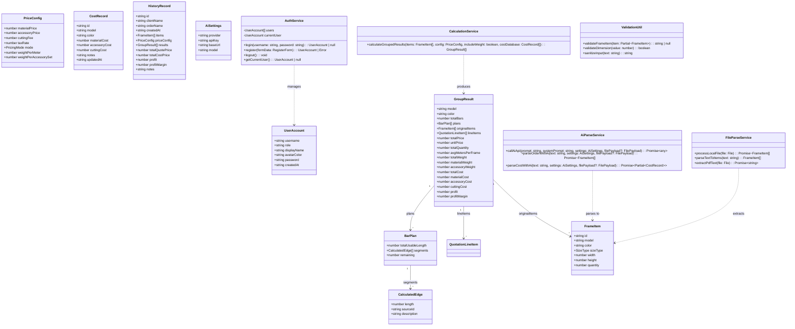
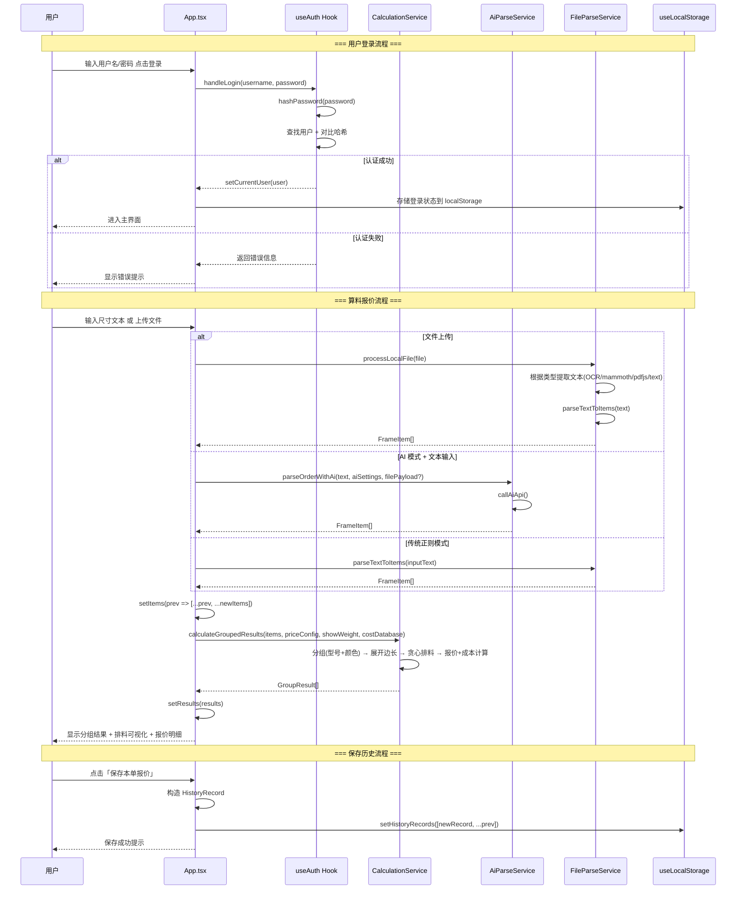

# Nova2 铝合金画框切框算料报价系统 — 重构方案与任务分解

> **版本**: v1.0 | **日期**: 2026-02-03 | **作者**: Architect Bob

---

## Part A: 重构方案设计

### 一、问题全景与修复策略总览

| 编号 | 级别 | 问题 | 修复方案 | 复杂度 |
|------|------|------|----------|--------|
| P0-1 | 致命 | `handleLogin` / `handleRegister` 未定义，登录/注册崩溃 | 新增两个函数实现完整的认证逻辑 | 中等 |
| P0-2 | 致命 | 缺少 Vite 配置，开发服务器无法启动 | 新建 `vite.config.ts` + `tsconfig.json` + `tsconfig.app.json` + `vite-env.d.ts` | 简单 |
| P0-3 | 致命 | `geminiService.ts` 引用 `process.env.API_KEY`（浏览器端不可用），模型名错误 | 删除死代码文件；统一使用 `aiService.ts` 的 fetch 方式调用 | 简单 |
| P1-4 | 重要 | `.substr()` 已废弃（ES 规范标记为 Legacy） | 全量替换为 `.substring()` | 简单 |
| P1-5 | 重要 | `@google/genai` 死代码（geminiService.ts 从未被 import） | 删除 `services/geminiService.ts` 及 package.json 中的 `@google/genai` 依赖 | 简单 |
| P1-6 | 重要 | importmap 版本与 package.json 不一致（React ^19.2.4 vs ^19.2.7） | 统一版本号；迁移到 Vite 后移除 importmap CDN 方式 | 简单 |
| P1-7 | 重要 | 无 TypeScript 编译检查 | 创建 tsconfig.json 启用 strict 模式 | 简单 |
| P1-8 | 重要 | 密码明文存储（硬编码 '123'，localStorage 明文） | 引入简单哈希（SHA-256 via Web Crypto API）存储密码摘要；默认密码保持不变但存储时哈希化 | 中等 |
| P1-9 | 重要 | Tailwind 使用 CDN 版（生产环境不适用） | 迁移到 PostCSS + tailwindcss npm 包 + vite 插件方式 | 中等 |
| P1-10 | 重要 | PDF 不支持解析（仅返回提示文字） | 集成 pdfjs-dist 实现文本提取；importmap 已声明该依赖但未使用 | 中等 |

### 二、技术决策建议

#### 2.1 构建工具：引入 Vite 完整构建流程

**决策**：从当前"裸 HTML + importmap CDN"模式迁移到 **Vite 标准构建流程**

**理由**：
- 当前模式无法做 TypeScript 类型检查（无 tsconfig）
- 无法享受 HMR（热模块替换）开发体验
- 无法 tree-shaking 未使用的代码（如 @google/genai）
- 无法优化生产构建（压缩、分包、hash 缓存）
- Electron main.js 已引用 `localhost:5173` 开发端口和 `dist/index.html` 生产路径，说明原设计就意图用 Vite

**配置方案**：
```
vite.config.ts     — React 插件 + 路径别名 @/*
tsconfig.json       — 项目根引用、strict 模式
tsconfig.app.json   — React JSX 转换、DOM 类型
vite-env.d.ts       — Vite/React 类型声明
postcss.config.js   — Tailwind CSS PostCSS 插件
tailwind.config.js  — 自定义主题扩展
index.html          — 精简为标准 Vite 入口（移除 importmap）
```

#### 2.2 CSS 方案：Tailwind CDN → PostCSS + npm 包

**决策**：将 `<script src="https://cdn.tailwindcss.com">` 替换为 `tailwindcss` + `@tailwindcss/vite`（或 postcss 方式）

**理由**：
- CDN 版无法 purge unused classes（全量加载 ~4MB CSS）
- 无法使用自定义配置（theme extend 等）
- 生产环境不应依赖外部 CDN 可用性

#### 2.3 项目结构重组：拆分 App.tsx

**决策**：将 ~2400 行的 App.tsx 按功能域拆分为多个组件和 hooks

**目标结构**：
```
src/
├── main.tsx                    # 入口（已有 index.tsx，重命名）
├── App.tsx                     # 主壳（路由/布局/标签切换，< 150 行）
├── types.ts                    # 类型定义（保持不变）
├── constants.ts                # 常量（保持不变）
├── hooks/
│   ├── useAuth.ts              # 认证逻辑（login/register/users/currentUser）
│   ├── useLocalStorage.ts      # LocalStorage 持久化 hook（统一管理所有 localStorage 操作）
│   └── useCalculation.ts       # 算料计算状态（items/results/calculate）
├── components/
│   ├── layout/
│   │   ├── Sidebar.tsx         # 侧边栏导航
│   │   └── Header.tsx          # 页面头部
│   ├── auth/
│   │   └── LoginForm.tsx       # 登录/注册表单
│   ├── quote/
│   │   ├── QuoteWorkspace.tsx  # 报价算料工作区主面板
│   │   ├── ClientInfoCard.tsx  # 客户信息卡片
│   │   ├── PriceConfigCard.tsx # 价格参数配置卡片
│   │   ├── InputPanel.tsx      # 录入面板（文本+拖拽上传）
│   │   ├── ItemListPanel.tsx   # 明细池列表
│   │   ├── ResultsDashboard.tsx# 成本毛利仪表盘
│   │   ├── ResultGroup.tsx     # 单组结果展示
│   │   └── FinalSummary.tsx    # 底部最终结算
│   ├── cost/
│   │   ├── CostDatabase.tsx    # 成本资料库页面
│   │   └── CostForm.tsx        # 成本录入表单
│   ├── history/
│   │   └── HistoryPanel.tsx    # 历史记录页面
│   ├── settings/
│   │   └── SettingsPanel.tsx   # AI 设置 / 数据备份 / 系统配置
│   └── BarVisualizer.tsx       # 材料可视化（保持不变）
├── services/
│   ├── aiService.ts            # AI 解析服务（保留，清理 .substr()）
│   └── parsingService.ts       # 文件解析服务（增加 PDF 支持，清理 .substr()）
├── utils/
│   ├── calculation.ts          # 核心计算逻辑（保持不变）
│   └── validation.ts           # 新增：输入校验工具函数
└── styles/
    └── globals.css             # Tailwind 指令 + 自定义样式
```

> **注意**：本次重构采用渐进式策略——T01 建立基础设施并让项目可运行，T02 修复致命 bug 并清理死代码，T03 做 App.tsx 功能性拆分（按域拆分而非逐行拆分），T04 完善 PDF/校验等功能增强，T05 集成测试与收尾。避免一次性大爆炸式重构。

---

### 三、数据结构与接口设计（Mermaid 类图）



---

### 四、核心程序调用流程（Mermaid 序列图）



---

### 五、P0 问题详细修复方案

#### 5.1 修复 `handleLogin` / `handleRegister` 缺失（P0-1）

**根因分析**：App.tsx 第 790 行 `<form onSubmit={handleLogin}>` 和第 858 行 `<form onSubmit={handleRegister}>` 引用了这两个函数，但在整个 ~2400 行的文件中从未定义。

**实现方案**（在 `hooks/useAuth.ts` 中实现，或在 App.tsx 中临时补上）：

```typescript
// handleLogin: 验证用户名密码 → 匹配 users 数组 → setCurrentUser
const handleLogin = (e: React.FormEvent) => {
  e.preventDefault();
  setLoginError('');

  const user = users.find(u =>
    u.username === loginForm.username.trim() &&
    u.password === loginForm.password  // TODO: T04 改为哈希比对
  );

  if (!user) {
    setLoginError('用户名或密码错误');
    return;
  }
  setCurrentUser(user);
};

// handleRegister: 校验重复 → 创建新用户 → 加入 users 数组
const handleRegister = (e: React.FormEvent) => {
  e.preventDefault();
  setRegisterError('');

  const { username, password, displayName, role } = registerForm;

  if (!username.trim() || !password.trim()) {
    setRegisterError('用户名和密码不能为空');
    return;
  }
  if (users.find(u => u.username === username.trim())) {
    setRegisterError('该用户名已被注册');
    return;
  }

  const newUser: UserAccount = {
    username: username.trim(),
    password, // TODO: T04 改为存储哈希
    role,
    displayName: displayName.trim(),
    avatarColor: role === 'admin' ? 'indigo' : role === 'sales' ? 'emerald' : 'amber',
    createdAt: new Date().toISOString()
  };

  setUsers(prev => [...prev, newUser]);
  setRegisterForm({ username: '', password: '', displayName: '', role: 'sales' });
  setIsRegisterMode(false);
  setLoginError('注册成功！请使用新账号登录');
};
```

#### 5.2 修复 Vite 配置缺失（P0-2）

创建以下文件：

**vite.config.ts**:
```typescript
import { defineConfig } from 'vite';
import react from '@vitejs/plugin-react';
import path from 'path';

export default defineConfig({
  plugins: [react()],
  resolve: {
    alias: {
      '@': path.resolve(__dirname, './src')
    }
  },
  server: {
    port: 5173,
    open: true
  },
  build: {
    outDir: 'dist',
    sourcemap: true
  },
  base: './'  // Electron 兼容：相对路径
});
```

**tsconfig.json** (工程引用模式):
```json
{
  "files": [],
  "references": [
    { "path": "./tsconfig.app.json" }
  ]
}
```

**tsconfig.app.json**:
```json
{
  "compilerOptions": {
    "target": "ES2020",
    "useDefineForClassFields": true,
    "lib": ["ES2020", "DOM", "DOM.Iterable"],
    "module": "ESNext",
    "skipLibCheck": true,
    "moduleResolution": "bundler",
    "allowImportingTsExtensions": true,
    "isolatedModules": true,
    "moduleDetection": "force",
    "noEmit": true,
    "jsx": "react-jsx",
    "strict": true,
    "noUnusedLocals": true,
    "noUnusedParameters": true,
    "noFallthroughCasesInSwitch": true,
    "baseUrl": ".",
    "paths": {
      "@/*": ["./src/*"]
    }
  },
  "include": ["src"]
}
```

同时需要：
- 将 `index.tsx` 移动到 `src/main.tsx`
- 将现有源文件移动到 `src/` 目录下
- 更新 `index.html` 为标准 Vite 入口（移除 importmap，改为 `<script type="module" src="/src/main.tsx"></script>`）

#### 5.3 清理 geminiService.ts 死代码（P0-3）

**操作**：
1. 删除 `services/geminiService.ts`
2. 从 `package.json` 的 dependencies 中移除 `"@google/genai": "^2.11.0"`
3. 确认没有任何文件 import geminiService（已确认：确实没有）

---

### 六、P1 问题详细修复方案

#### 6.1 .substr() 替换为 .substring()（P1-4）

涉及位置（全局搜索确认）：
| 文件 | 行号（近似） | 用途 |
|------|-------------|------|
| App.tsx | ~401 | ID 生成随机字符串截取 |
| App.tsx | ~496 | 同上（成本导入 ID 生成） |
| aiService.ts | ~195 | AI 解析结果 ID 生成 |
| aiService.ts | ~222 | 成本解析结果 ID 生成 |
| parsingService.ts | ~38 | 本地解析结果 ID 生成 |

**替换规则**：`.substr(start, length)` → `.substring(start, start + length)`（语义完全等价）

#### 6.2 密码哈希化（P1-8）

引入 Web Crypto API 的 SHA-256：
```typescript
// utils/crypto.ts
export async function hashPassword(password: string): Promise<string> {
  const encoder = new TextEncoder();
  const data = encoder.encode(password + '_nova2_salt'); // 固定盐值防彩虹表
  const hashBuffer = await crypto.subtle.digest('SHA-256', data);
  const hashArray = Array.from(new Uint8Array(hashBuffer));
  return hashArray.map(b => b.toString(16).padStart(2, '0')).join('');
}
```

迁移策略：
- 首次加载时检测旧格式明文密码 → 自动升级为哈希存储
- 新注册用户直接存储哈希
- 登录时对输入密码做哈希后对比存储值

#### 6.3 Tailwind 迁移到 PostCSS（P1-9）

```bash
npm install -D tailwindcss @tailwindcss/vite
```

**postcss.config.js**:
```javascript
export default {
  plugins: {
    tailwindcss: {},
  },
};
```

**src/styles/globals.css**:
```css
@import "tailwindcss";

/* 自定义样式 */
@import url('https://fonts.googleapis.com/css2?family=Inter:wght@400;500;600;700&display=swap');
body { font-family: 'Inter', 'PingFang SC', 'Microsoft YaHei', sans-serif; }
.custom-scrollbar::-webkit-scrollbar { width: 4px; }
/* ... */
```

#### 6.4 PDF 解析支持（P1-10）

在 `parsingService.ts` 中集成 pdfjs-dist：
```typescript
import * as pdfjsLib from 'pdfjs-dist';

// 设置 worker（Vite 环境需要特殊处理）
pdfjsLib.GlobalWorkerOptions.workerSrc = new URL(
  'pdfjs-dist/build/pdf.worker.mjs',
  import.meta.url
).toString();

async function extractPdfText(file: File): Promise<string> {
  const arrayBuffer = await file.arrayBuffer();
  const pdf = await pdfjsLib.getDocument(arrayBuffer).promise;
  let fullText = '';
  for (let i = 1; i <= pdf.numPages; i++) {
    const page = await pdf.getPage(i);
    const content = await page.getTextContent();
    fullText += content.items.map((item: any) => item.str).join(' ') + '\n';
  }
  return fullText;
}
```

---

### 七、不确定事项与假设

1. **Electron 是否必须？** — 项目可同时以纯 Web 方式运行（当前 importmap 模式就是纯 Web）。本次重构优先保证 Web 可用，Electron 作为可选桌面包装。
2. **是否保留 importmap 兼容？** — 迁移到 Vite 后不再需要 importmap。但如果希望支持零安装直接打开 HTML，可以保留一个简化版 fallback。
3. **tesseract.js 版本** — importmap 声明 `^5.1.0` 但 package.json 是 `^7.0.0`，需统一。建议跟随 package.json 用 ^7.0.0。
4. **mammoth 依赖用途** — parsingService.ts 用于解析 docx，功能正常，予以保留。
5. **AI 多模态图片识别的 base64 大小限制** — 当前未做大小限制/压缩，大图片可能导致 API 调用失败。本次暂不做处理，记录为后续优化点。
6. **默认用户密码 '123' 的安全性** — 这是演示/本地工具，非云端系统。哈希化后风险可控。不建议强制要求强密码策略（影响本地工具易用性）。

---

## Part B: 任务分解

### 八、所需第三方依赖包

```
# 生产依赖
react@^19.2.7              # UI 框架（已有）
react-dom@^19.2.7           # DOM 渲染（已有）
tesseract.js@^7.0.0         # OCR 图片文字识别（已有）
mammoth@^1.12.0             # Word 文档解析（已有）
pdfjs-dist@^4.0.379         # PDF 文本提取（importmap 已声明，需实际接入）

# 开发依赖
vite@^5.0.0                 # 构建工具（已在 devDependencies）
@vitejs/plugin-react@^4.3.0 # Vite React 插件（需新增）
typescript@^5.5.0            # TypeScript 编译器（需新增）
tailwindcss@^4.0.0          # CSS 框架（需新增，替换 CDN）
@tailwindcss/vite@^4.0.0    # Tailwind Vite 插件（需新增）
electron@^28.2.0            # 桌面包装（已有，可选）
electron-builder@^24.9.1    # 打包工具（已有，可选）

# 移除的依赖
@google/genai               # 死代码依赖，删除
```

### 九、任务列表（共 5 个任务，按依赖排序）

---

#### T01: 项目基础设施搭建 + 构建系统迁移

**描述**：建立标准的 Vite + React + TypeScript + Tailwind 开发环境，使项目可以通过 `npm run dev` 正常启动运行。这是所有后续任务的前提。

**涉及文件**（新建/修改）：

| 操作 | 文件路径 | 说明 |
|------|----------|------|
| 新建 | `vite.config.ts` | Vite 配置（React 插件 + 路径别名 + Electron 相对路径 base） |
| 新建 | `tsconfig.json` | 工程引用根配置 |
| 新建 | `tsconfig.app.json` | TypeScript 编译选项（strict、JSX、路径别名） |
| 新建 | `vite-env.d.ts` | Vite/React 环境类型声明 |
| 新建 | `postcss.config.js` | PostCSS 配置（Tailwind 插件） |
| 新建 | `src/styles/globals.css` | Tailwind 指令 + 自定义样式（从 index.html 内联 style 迁移） |
| 新建 | `src/main.tsx` | React 入口（从 index.tsx 迁移） |
| 新建 | `src/App.tsx` | 应用主壳（从 App.tsx 迁移，初始仅做路由分发） |
| 新建 | `src/types.ts` | 类型定义（从 types.ts 迁移） |
| 新建 | `src/constants.ts` | 常量定义（从 constants.ts 迁移） |
| 新建 | `src/utils/calculation.ts` | 计算逻辑（从 utils/calculation.ts 迁移） |
| 新建 | `src/services/aiService.ts` | AI 服务（从 services/aiService.ts 迁移） |
| 新建 | `src/services/parsingService.ts` | 解析服务（从 services/parsingService.ts 迁移） |
| 新建 | `src/components/BarVisualizer.tsx` | 可视化组件（从 components/ 迁移） |
| 修改 | `index.html` | 精简为 Vite 标准入口（移除 importmap、CDN Tailwind、内联样式） |
| 修改 | `package.json` | 更新 scripts（dev/build）、添加缺失 devDependencies、移除 @google/genai |

**验证标准**：
- `npm run dev` 能正常启动开发服务器（http://localhost:5173）
- 页面能渲染基本布局（侧边栏 + 登录界面）
- TypeScript 编译无报错（`npx tsc --noEmit` 通过）
- Tailwind 样式正确加载（不再是 CDN 版本）

**复杂度**：**中等**（文件较多但每个都是模板化的配置文件）

**依赖**：无（第一个任务）

**优先级**：P0

---

#### T02: 致命 Bug 修复 + 死代码清理 + 安全加固

**描述**：修复导致应用不可用的致命缺陷（登录/注册崩溃）、清理无用代码、修复废弃 API 调用。此任务完成后，核心功能应全部可用。

**涉及文件**：

| 操作 | 文件路径 | 说明 |
|------|----------|------|
| 修改 | `src/App.tsx` | 实现 handleLogin + handleRegister 函数补全认证流程 |
| 新建 | `src/hooks/useAuth.ts` | 抽取认证相关状态与逻辑（users/currentUser/loginForm/registerForm/login/register/logout） |
| 新建 | `src/hooks/useLocalStorage.ts` | 抽取统一的 localStorage 持久化管理 hook |
| 删除 | `services/geminiService.ts` | 死代码（P0-3） |
| 修改 | `src/services/aiService.ts` | 全部 `.substr()` 替换为 `.substring()`（P1-4） |
| 修改 | `src/services/parsingService.ts` | `.substr()` 替换 + 增加 PDF 文本提取能力（P1-10） |
| 修改 | `src/utils/validation.ts`（新建） | 输入校验工具（负数拒绝、超大尺寸警告、空值过滤）（P2-12） |
| 修改 | `package.json` | 确认移除 @google/genai 依赖 |

**handleLogin/handleRegister 详细实现要求**：
- `handleLogin`: 表单提交 → 查找 users 数组匹配 username+password → 成功则 `setCurrentUser(matchedUser)` → 失败则 `setLoginError('用户名或密码错误')` → `e.preventDefault()` 防止刷新
- `handleRegister`: 表单提交 → 校验 username 非空且不重复 → 校验 password 非空 → 创建 UserAccount → `setUsers(prev => [...prev, newUser])` → 切换回登录模式 → 清空表单
- 快速登入按钮（admin/sales/operator）不受影响（它们直接调用 setCurrentUser，不走 handleLogin）

**验证标准**：
- 登录表单提交不再报错（`handleLogin is not defined` 修复）
- 注册表单提交不再报错（`handleRegister is not defined` 修复）
- 正确密码能登录成功进入主界面
- 错误密码显示错误提示
- 注册新用户后能用新账号登录
- TypeScript 编译通过
- `geminiService.ts` 已不存在于代码库中

**复杂度**：**中等**（handleLogin/handleRegister 逻辑较重要，其他都是机械性改动）

**依赖**：T01（必须在新的 src/ 目录结构下工作）

**优先级**：P0

---

#### T03: App.tsx 组件化拆分（按功能域）

**描述**：将 App.tsx 从超大单体文件拆分为功能域组件和自定义 Hooks。拆分原则：**按业务域而非 UI 粒度**，保证每个拆出文件有独立职责和足够体量。

**涉及文件**：

| 操作 | 文件路径 | 说明 | 预估行数 |
|------|----------|------|----------|
| 新建 | `src/components/auth/LoginForm.tsx` | 登录/注册双表单（从 App.tsx 第 753-929 行抽取） | ~180 行 |
| 新建 | `src/components/layout/Sidebar.tsx` | 侧边栏导航 + 用户卡片 + 隐私开关（第 936-1043 行） | ~120 行 |
| 新建 | `src/components/quote/QuoteWorkspace.tsx` | 报价算料完整工作区（第 1056-1477 行） | ~420 行 |
| 新建 | `src/components/quote/ClientInfoCard.tsx` | 客户信息录入卡片 | ~40 行 |
| 新建 | `src/components/quote/PriceConfigCard.tsx` | 报价计费参数配置卡片 | ~60 行 |
| 新建 | `src/components/quote/InputPanel.tsx` | 快捷录入 + 拖拽上传 + 文件选择 | ~120 行 |
| 新建 | `src/components/quote/ItemListPanel.tsx` | 当前明细池列表 | ~40 行 |
| 新建 | `src/components/quote/ResultsDashboard.tsx` | 成本毛利仪表盘 | ~50 行 |
| 新建 | `src/components/quote/FinalSummary.tsx` | 底部最终结算区域 | ~30 行 |
| 新建 | `src/components/cost/CostDatabase.tsx` | 成本资料库完整页面（从 cost tab 抽取） | ~250 行 |
| 新建 | `src/components/history/HistoryPanel.tsx` | 历史记录完整页面（从 history tab 抽取） | ~200 行 |
| 新建 | `src/components/settings/SettingsPanel.tsx` | AI 设置 + 数据备份导入导出（从 settings tab 抽取） | ~250 行 |
| 新建 | `src/hooks/useCalculation.ts` | 算料核心状态 hook（items/results/calculate/add/remove/clear） | ~80 行 |
| 修改 | `src/App.tsx` | 精简为路由壳（activeTab 分发 + 条件渲染子组件） | < 100 行 |

**Props 设计原则**：
- 子组件通过 props 接收数据和回调
- 共享状态通过 useAuth / useCalculation / useLocalStorage hooks 管理
- 避免 prop drilling 过深（超过 3 层时考虑 context）

**App.tsx 拆分后的结构示意**：
```tsx
function App() {
  const { currentUser, loginForm, ...authActions } = useAuth();
  const { items, results, ...calcActions } = useCalculation(currentUser);
  // ... 其他 hooks

  if (!currentUser) return <LoginForm {...authProps} />;

  return (
    <div className="flex min-h-screen">
      <Sidebar {...sidebarProps} />
      <main>
        {activeTab === 'quote' && <QuoteWorkspace {...quoteProps} />}
        {activeTab === 'cost' && <CostDatabase {...costProps} />}
        {activeTab === 'history' && <HistoryPanel {...historyProps} />}
        {activeTab === 'settings' && <SettingsPanel {...settingsProps} />}
      </main>
    </div>
  );
}
```

**验证标准**：
- App.tsx < 150 行
- 所有原有功能正常运行（登录→算料→成本库→历史→设置 完整流程）
- 各组件独立可读、职责清晰
- TypeScript 严格模式编译无报错

**复杂度**：**复杂**（文件多、需确保 props 传递正确、状态同步无误）

**依赖**：T01, T02（必须在 bug 修复后的稳定代码基础上拆分）

**优先级**：P1

---

#### T04: 功能完善（PDF 解析 + 密码哈希 + 输入校验 + 导出增强）

**描述**：在核心功能可用之后，完善 P1 级别体验问题和部分 P2 增强功能。

**涉及文件**：

| 操作 | 文件路径 | 说明 |
|------|----------|------|
| 修改 | `src/hooks/useAuth.ts` | 密码哈希化改造：存储时 SHA-256、首次加载自动迁移明文密码（P1-8） |
| 新建 | `src/utils/crypto.ts` | Web Crypto API SHA-256 封装 |
| 修改 | `src/services/parsingService.ts` | 完成 pdfjs-dist 集成（T02 已预留接口，此处实现具体 PDF 提取逻辑）（P1-10） |
| 修改 | `src/utils/validation.ts` | 扩展校验规则（宽度/高度合理范围 1-500cm、数量上限 9999、型号格式）（P2-12） |
| 修改 | `src/components/quote/QuoteWorkspace.tsx` | 在 add item 前调用 validation 校验，显示友好错误提示 |
| 新建 | `src/utils/exportPdf.ts` | 报价单 PDF 导出功能（基于 html2canvas + jspdf 或 window.print 优化版）（P2-11） |
| 修改 | `src/components/quote/FinalSummary.tsx` | 增加「导出 PDF 报价单」按钮 |

**密码哈希化迁移策略**（关键）：
```
应用启动 → 读取 users from localStorage
  → 检测每个 user.password 格式
    → 如果是 64 字符十六进制字符串（已是哈希）→ 保持
    → 如果是短字符串（明文，如 "123"）→ 自动 hashPassword() 后写回
  → 之后所有登录/注册都走哈希流程
```

**PDF 报价单导出方案**：
- 使用 `window.print()` + `@media print` CSS 作为轻量方案（无需额外依赖）
- 或引入 `html2canvas` + `jspdf` 做客户端 PDF 生成
- 推荐：先实现 print 方案作为 MVP，后续迭代再考虑精美 PDF

**验证标准**：
- PDF 文件上传能正确提取文字内容并解析为 FrameItem[]
- 密码在 localStorage 中以哈希形式存储（不再是明文 '123'）
- 输入负数/超大尺寸时有明确的错误提示
- 「导出报价单」按钮能触发打印或 PDF 下载

**复杂度**：**中等**（每个子功能独立，互不影响）

**依赖**：T01, T02（基础环境和 bug 修复）

**优先级**：P1

---

#### T05: 集成测试 + 收尾优化 + 文档

**描述**：为核心计算逻辑编写单元测试，做最终的端到端验证，更新 README。

**涉及文件**：

| 操作 | 文件路径 | 说明 |
|------|----------|------|
| 新建 | `src/__tests__/calculation.test.ts` | calculateGroupedResults 单元测试（批量模式、零散模式、边界条件） |
| 新建 | `src/__tests__/parsingService.test.ts` | parseTextToItems 测试（各种格式的尺寸文本解析） |
| 新建 | `src/__tests__/validation.test.ts` | validateFrameItem 测试（合法/非法输入） |
| 修改 | `package.json` | 添加 vitest 测试框架依赖 + test script |
| 新建 | `vitest.config.ts` | Vitest 配置（兼容 Vite 环境） |
| 修改 | `src/styles/globals.css` | 响应式适配微调（移动端断点、表格横向滚动）（P2-14） |
| 修改 | `src/App.tsx` / `src/hooks/useAuth.ts` | 暗色模式基础架构（Tailwind dark: 前缀 + localStorage 持久化偏好）（P2-15） |

**测试覆盖重点**：

```typescript
// calculation.test.ts 关键测试用例
describe('calculateGroupedResults', () => {
  it('批量模式: 单一规格正确计算支数和价格', () => { ... });
  it('批量模式: 多种规格合并后支数更优', () => { ... });
  it('零散模式: 每个尺寸独立按周长计价', () => { ... });
  it('内径尺寸正确加壁厚', () => { ... });
  it('空数组返回空结果', () => { ... });
  it('成本库匹配优先级: 型号+颜色 > 仅型号 > 默认比例', () => { ... });
  it('重量计算开关控制', () => { ... });
});

// parsingService.test.ts 关键测试用例
describe('parseTextToItems', () => {
  it('标准格式: D1822 黑色 80x60 10', () => { ... });
  it('继承上下文的型号颜色', () => { ... });
  it('内径标识正确解析', () => { ... });
  it('多种分隔符兼容 (* × x X)', () => { ... });
  it('空输入返回空数组', () => { ... });
});
```

**验证标准**：
- `npm test` 全部通过
- 核心计算逻辑测试覆盖率 > 80%
- 手动端到端测试清单全部通过：
  - [ ] admin 账号登录 → 进入主界面
  - [ ] 注册新销售员账号 → 用新账号登录
  - [ ] 手动录入 D1822 黑色 80x60 10 外径 → 出现结果
  - [ ] 上传包含多行的 txt 文件 → 批量解析
  - [ ] 上传图片（如有 AI key）→ AI 识别
  - [ ] 切换批量/零散模式 → 价格变化
  - [ ] 修改底价库 → 利润率联动变化
  - [ ] 保存报价 → 历史记录可查 → 载入恢复
  - [ ] 导出 CSV → 文件可打开
  - [ ] 退出登录 → 回到登录页
  - [ ] operator 账号登录 → 底价隐藏

**复杂度**：**中等**（测试用例较多但模式固定）

**依赖**：T01, T02, T03, T04（最后执行，基于所有功能完成后的代码）

**优先级**：P2

---

### 十、跨任务共享知识

```
## 状态管理模式
- 本项目使用 React useState + useCallback（无 Redux/Zustand）
- 拆分后通过 Custom Hooks 封装领域逻辑，避免 prop drilling
- localStorage 是唯一的持久化存储（无后端服务）
- 用户数据按 username 隔离命名空间: aluminum_${key}_${username}

## 文件命名约定
- 组件文件: PascalCase.tsx (e.g., QuoteWorkspace.tsx)
- Hooks 文件: camelCase.ts (e.g., useAuth.ts)
- 工具函数: camelCase.ts (e.g., validation.ts)
- 服务文件: camelCase.ts (e.g., aiService.ts)
- 常量: UPPER_SNAKE_CASE (e.g., BAR_FULL_LENGTH)

## 样式规范
- 100% Tailwind utility classes（不写自定义 CSS 除非必要）
- 响应式断点: sm:640px md:768px lg:1024px xl:1280px
- 圆角规范: 卡片 rounded-[2rem]/rounded-[2.5rem], 输入 rounded-xl, 按钮 rounded-xl
- 字体大小: 正文 text-xs(12px), 小字 text-[9px]-text-[11px], 标题 text-lg/text-2xl/text-3xl
- 颜色体系: 主色 indigo-600, 成功 emerald-600, 警告 amber-500, 错误 rose-500/red-500

## AI 服务兼容性
- Gemini: REST API (generativelanguage.googleapis.com)，key 作为 URL query param
- DeepSeek/OpenAI: OpenAI 兼容格式 (/chat/completions)，Bearer token
- 多模态: Gemini 用 inlineData, OpenAI 用 image_url (base64)
- 统一入口: services/aiService.ts 的 callAiApi()

## Electron 注意事项
- build.base 必须设为 './'（相对路径），否则 Electron 加载 dist/index.html 会找不到资源
- nodeIntegration: true + contextIsolation: false (main.js 已配置)
- 开发模式: Vite devServer 端口 5173（main.js 已硬编码）
```

---

### 十一、任务依赖关系图

```mermaid
graph TD
    T01[T01: 基础设施搭建<br/>Vite+TS+Tailwind 迁移] --> T02[T02: Bug 修复 + 死代码清理<br/>登录/注册/.substr()/gemini]
    T01 --> T04[T04: 功能完善<br/>PDF+密码哈希+校验+导出]
    T02 --> T03[T03: App.tsx 组件化拆分<br/>按域拆分至 15+ 组件]
    T03 --> T05[T05: 集成测试 + 收尾<br/>单元测试+E2E+文档]
    T04 --> T05

    style T01 fill:#e0e7ff,stroke:#4f46e5,color:#4f46e5
    style T02 fill:#fee2e2,stroke:#dc2626,color:#dc2626
    style T03 fill:#fef3c7,stroke:#d97706,color:#d97706
    style T04 fill:#d1fae5,stroke:#059669,color:#059669
    style T05 fill:#f3e8ff,stroke:#7c3aed,color:#7c3aed
```

---

### 十二、实施顺序总结

| 步骤 | 任务 | 预估工作量 | 风险 | 产出 |
|------|------|-----------|------|------|
| 1 | T01: 基础设施 | 2-3h | 低 | 可运行的 Vite 项目 |
| 2 | T02: Bug 修复 | 1-2h | 低 | 功能可用的应用 |
| 3 | T04: 功能完善 | 2-3h | 中 | PDF/安全/校验/导出 |
| 4 | T03: 组件拆分 | 3-4h | 中高 | 可维护的组件架构 |
| 5 | T05: 测试收尾 | 2-3h | 低 | 有质量保障的交付物 |

> **注意**：T03 和 T04 可以并行（T04 只依赖 T01+T02，不依赖 T03 的拆分）。但考虑到 T04 修改的文件在 T03 拆分后会位于不同路径，建议 **T04 在 T03 之前或同时进行**，减少 merge 冲突。上图已反映推荐的 T02→T04→T03 顺序。

---

*文档结束。下一步由 Engineer 根据 T01-T05 任务列表依次实现。*
