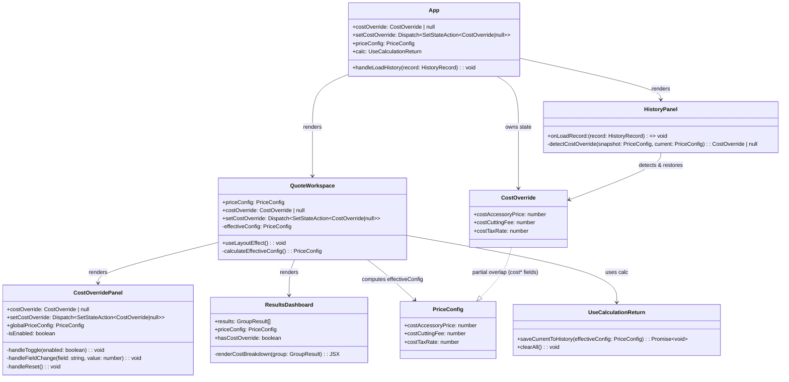
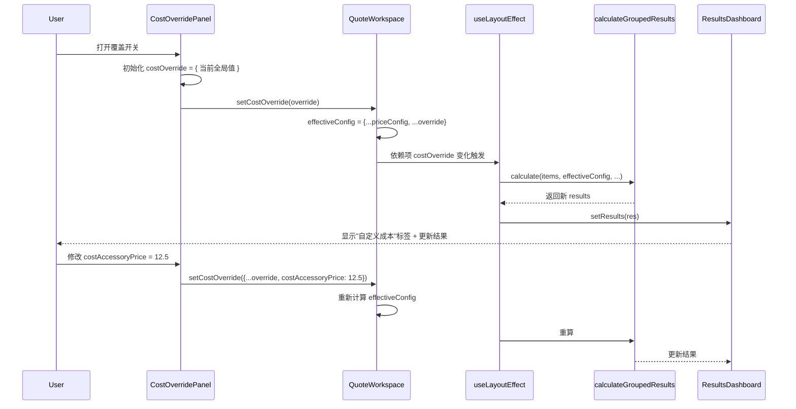
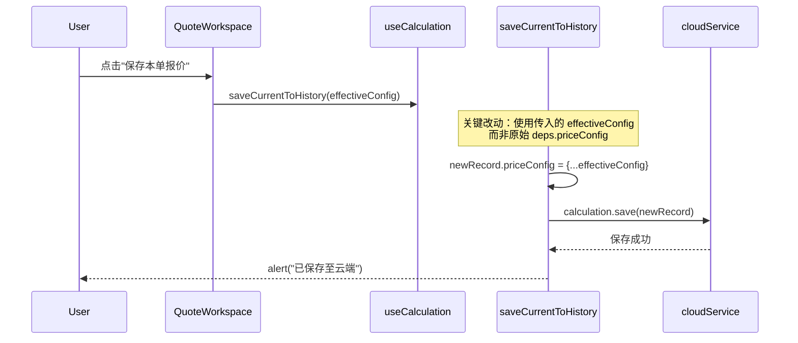
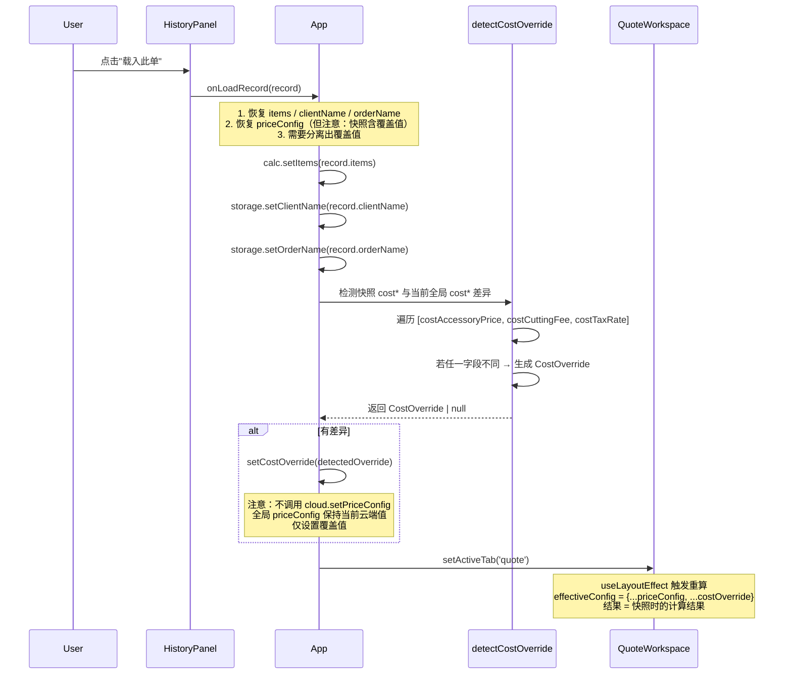
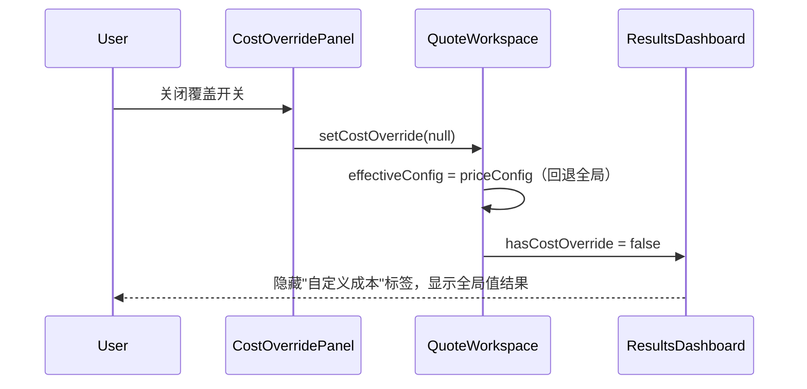
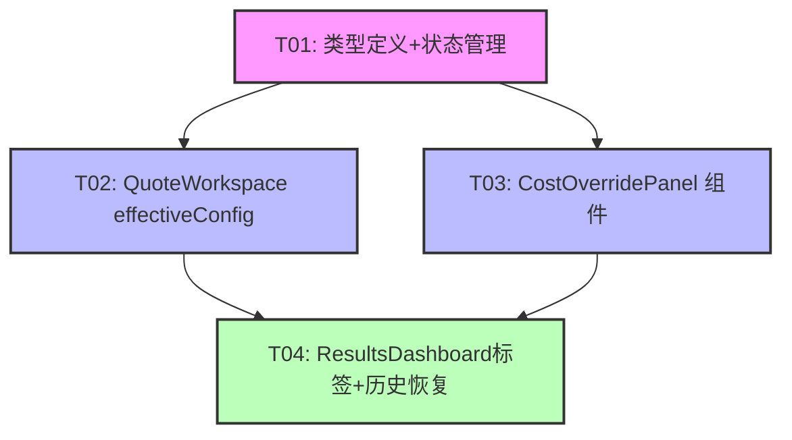

# nova2 增量系统设计：成本费率覆盖功能

> 架构师：高见远（Gao）  
> 基于 PRD：许清楚（Alice）增量 PRD  
> 日期：2025-01

---

## Part A: 系统设计

### 1. 实现方案

#### 核心技术挑战

1. **覆盖值的生命周期管理**：覆盖值需在切 Tab 时不丢失，但又不能污染全局 priceConfig（不写回云端）
2. **计算引擎透明接入**：计算引擎 `calculateGroupedResults` 不改动，调用方传入 `effectiveConfig` 即可
3. **历史快照完整性**：保存历史时需快照 effectiveConfig（含覆盖值），载入历史时需恢复覆盖状态
4. **UI 联动**：覆盖开关、字段编辑、差异提示、重置按钮之间的状态联动

#### 方案选型：effectiveConfig 模式（最小改动原则）

**核心思路**：在 `QuoteWorkspace` 内部计算 `effectiveConfig = costOverride ? { ...priceConfig, ...costOverride } : priceConfig`，将 `effectiveConfig` 传给计算引擎和结果展示组件，而全局 `priceConfig` 保持不变。

**为什么不改计算引擎**：`calculateGroupedResults(items, config, showWeight, costDatabase)` 已接受 `config: PriceConfig` 参数，调用方传什么就用什么。只需在调用处替换为 `effectiveConfig`，零改动。

**为什么 costOverride 放 QuoteWorkspace 而非 App**：
- 覆盖值是报价工作区的局部状态，与 CostDatabasePanel / CostProfitPanel / HistoryPanel 无直接交互
- QuoteWorkspace 的 `useLayoutEffect` 是重算入口，在此处合并 effectiveConfig 最直接
- App 层只负责数据路由，不应感知"覆盖"这种业务概念
- 切 Tab 不会卸载 QuoteWorkspace（当前架构用条件渲染 `{activeTab === 'quote' && ...}`，切走时确实会卸载，但 PRD Q1 已确认覆盖 state 建议由父组件持有）

**修正：costOverride 应放 App 层**
经过对 App.tsx 代码的分析，`{activeTab === 'quote' && <QuoteWorkspace ... />}` 是条件渲染，切 Tab 时 QuoteWorkspace 会被卸载，本地 state 会丢失。因此 costOverride 必须提升到 App 层，通过 props 下发给 QuoteWorkspace。

#### 数据流设计

```
App.tsx
  ├── costOverride state (null | CostOverride)     ← 新增
  ├── setCostOverride                              ← 新增
  │
  ├── useCloudData → priceConfig (全局基线)
  │
  ├── QuoteWorkspace
  │     ├── props: priceConfig, costOverride, setCostOverride
  │     ├── 内部计算: effectiveConfig = costOverride ? {...priceConfig, ...costOverride} : priceConfig
  │     ├── useLayoutEffect → calculateGroupedResults(items, effectiveConfig, ...)  ← 改动点
  │     ├── CostOverridePanel (新组件: 开关+三字段+重置)
  │     ├── PriceConfigCard (不变)
  │     ├── ResultsDashboard (props 增加 hasCostOverride 标识)
  │     └── FinalSummary (传 effectiveConfig)
  │
  ├── useCalculation
  │     ├── saveCurrentToHistory: 快照使用 effectiveConfig  ← 改动点
  │     └── clearAll: 同时重置 costOverride                ← 改动点
  │
  ├── HistoryPanel → onLoadRecord
  │     └── 检测快照 cost* 与当前全局 cost* 差异 → 自动设置 costOverride  ← 改动点
  │
  └── CostProfitPanel (不变，消费 results 即可)
```

### 2. 文件列表

| 文件路径 | 操作 | 说明 |
|---------|------|------|
| `src/types.ts` | **修改** | 新增 `CostOverride` 类型 |
| `src/App.tsx` | **修改** | 新增 costOverride state，下发给 QuoteWorkspace；HistoryPanel 载入时恢复覆盖 |
| `src/components/quote/QuoteWorkspace.tsx` | **修改** | 接收 costOverride props，计算 effectiveConfig，传给 useLayoutEffect |
| `src/hooks/useCalculation.ts` | **修改** | saveCurrentToHistory 快照使用 effectiveConfig；clearAll 回调重置覆盖 |
| `src/components/quote/CostOverridePanel.tsx` | **新增** | 成本费率覆盖 UI 组件（开关+三字段+差异提示+重置按钮） |
| `src/components/quote/ResultsDashboard.tsx` | **修改** | 新增 hasCostOverride props，显示"自定义成本"标签 |
| `src/components/history/HistoryPanel.tsx` | **修改** | onLoadRecord 逻辑增加覆盖值恢复（差异检测） |

### 3. 数据结构和接口

#### 3.1 新增类型定义

```typescript
// src/types.ts 新增

/**
 * 成本费率覆盖值（per-quote 临时覆盖，不写回全局）
 *
 * 三个字段对应 PriceConfig 中的 cost* 字段，
 * 覆盖时用 {...priceConfig, ...costOverride} 合成 effectiveConfig。
 */
export interface CostOverride {
  costAccessoryPrice: number;   // 覆盖成本配件单价
  costCuttingFee: number;       // 覆盖成本切割单价
  costTaxRate: number;          // 覆盖成本税率
}
```

#### 3.2 类图



#### 3.3 组件 Props 接口

```typescript
// CostOverridePanel props
interface CostOverridePanelProps {
  costOverride: CostOverride | null;
  setCostOverride: React.Dispatch<React.SetStateAction<CostOverride | null>>;
  globalPriceConfig: PriceConfig;  // 用于显示"全局默认: ¥X"
}

// QuoteWorkspace props 变更（新增两个字段）
interface QuoteWorkspaceProps {
  // ... 原有 props 不变 ...
  costOverride: CostOverride | null;                                    // 新增
  setCostOverride: React.Dispatch<React.SetStateAction<CostOverride | null>>;  // 新增
}

// ResultsDashboard props 变更（新增一个字段）
interface ResultsDashboardProps {
  // ... 原有 props 不变 ...
  hasCostOverride: boolean;  // 新增：是否显示"自定义成本"标签
}
```

### 4. 程序调用流程

#### 4.1 正常编辑覆盖值流程



#### 4.2 保存历史流程



#### 4.3 载入历史恢复覆盖流程



#### 4.4 关闭覆盖 / 重置流程



### 5. 待明确事项

#### Q1: costOverride state 应该放哪一层？

**架构建议：放 App 层（useState）**

理由：
- 当前 App.tsx 使用条件渲染 `{activeTab === 'quote' && <QuoteWorkspace />}`，切 Tab 时 QuoteWorkspace 会被卸载，本地 state 丢失
- costOverride 需要在 HistoryPanel 载入时设置（跨 Tab 操作：从 history Tab 设置，切到 quote Tab 生效）
- App 层是最合适的状态持有者，与 priceConfig / items / clientName 等同级

```typescript
// App.tsx 新增
const [costOverride, setCostOverride] = useState<CostOverride | null>(null);
```

#### Q2: loadFromHistory 在哪？如何接入覆盖值恢复？

**架构建议：在 App.tsx 的 onLoadRecord 回调中处理**

当前代码分析：
- `loadFromHistory` 的逻辑实际分散在 App.tsx 的 `onLoadRecord` 回调中（`HistoryPanel` 的 `onLoadRecord` prop）
- 当前实现：`calc.setItems(record.items)` + `cloud.setPriceConfig(record.priceConfig)` + 恢复 clientName/orderName

**关键问题**：当前代码 `cloud.setPriceConfig(record.priceConfig)` 会将快照（含覆盖值）直接写入全局 priceConfig，这**污染了全局**。正确做法应该是：
1. **不调用 `cloud.setPriceConfig`**（保持当前全局值不变）
2. 从快照中检测 cost* 字段与当前全局 cost* 的差异
3. 有差异 → `setCostOverride({ 差异字段 })`
4. 快照中的 quote* 字段如果也与当前不同，暂时也不恢复（quote* 是全局编辑的，不属于覆盖范围）

```typescript
// App.tsx onLoadRecord 改造
onLoadRecord={(record) => {
  if (confirm(`是否载入历史记录：【${record.clientName} - ${record.orderName}】？`)) {
    calc.setItems(record.items);
    storage.setClientName(record.clientName);
    storage.setOrderName(record.orderName);
    
    // 检测并恢复成本覆盖值
    const override = detectCostOverride(record.priceConfig, cloud.priceConfig);
    setCostOverride(override);
    
    setActiveTab('quote');
  }
}}

// 辅助函数
function detectCostOverride(snapshot: PriceConfig, current: PriceConfig): CostOverride | null {
  const fields: (keyof CostOverride)[] = ['costAccessoryPrice', 'costCuttingFee', 'costTaxRate'];
  const override: Partial<CostOverride> = {};
  let hasDiff = false;
  
  for (const field of fields) {
    if (Math.abs(snapshot[field] - current[field]) > 0.0001) {
      override[field] = snapshot[field];
      hasDiff = true;
    }
  }
  
  return hasDiff ? override as CostOverride : null;
}
```

#### Q3: "自定义成本"标签放哪？

**架构建议：放 ResultsDashboard**

理由：
- ResultsDashboard 是报价结果的展示入口，顶部汇总条已显示成本/利润信息
- "自定义成本"标签是结果层面的视觉标识，放在汇总条标题旁最自然
- CostProfitPanel 消费的是同一份 results，无需额外传参（results 已用 effectiveConfig 计算）
- 如果放 CostProfitPanel，需要额外传 `hasCostOverride` prop，增加耦合

具体位置：ResultsDashboard 顶部汇总卡片的"核算底价总成本"标签旁，显示橙色 badge "自定义成本"。

#### Q4: 关闭覆盖后跳到全局最新值是否 OK？

**架构建议：OK，关闭覆盖 = 回退到全局值**

行为定义：
- 关闭开关时：`setCostOverride(null)`
- effectiveConfig 自动回退为 `priceConfig`（当前全局值）
- useLayoutEffect 依赖项变化 → 自动重算 → 结果更新为全局费率计算值
- 不需要保留"关闭前的覆盖值"（关闭即丢弃，再次开启时重新初始化为当前全局值）

---

## Part B: 任务分解

### 6. Required Packages

无新增第三方包。本需求纯前端 state 管理 + UI 组件，使用现有技术栈（React 19 + TypeScript + Tailwind CSS v4）即可实现。

### 7. Task List

#### T01: 类型定义 + 状态管理基础设施

- **Task ID**: T01
- **Task Name**: 类型定义 + costOverride 状态管理
- **Source Files**:
  - `src/types.ts`（修改：新增 CostOverride 类型）
  - `src/App.tsx`（修改：新增 costOverride state，下发给 QuoteWorkspace；改造 onLoadRecord 恢复覆盖值）
  - `src/hooks/useCalculation.ts`（修改：saveCurrentToHistory 接受 effectiveConfig 参数；clearAll 增加重置覆盖回调）
- **Dependencies**: 无
- **Priority**: P0

**详细说明**：
1. `src/types.ts` 新增 `CostOverride` interface（3 个 cost* 字段）
2. `App.tsx` 新增 `const [costOverride, setCostOverride] = useState<CostOverride | null>(null)`
3. `App.tsx` 将 `costOverride` + `setCostOverride` 通过 props 传给 `QuoteWorkspace`
4. `App.tsx` 的 `onLoadRecord` 回调中：移除 `cloud.setPriceConfig(record.priceConfig)`，改为调用 `detectCostOverride(record.priceConfig, cloud.priceConfig)` 设置覆盖值
5. `useCalculation.ts` 的 `saveCurrentToHistory` 改为接受 `effectiveConfig: PriceConfig` 参数，快照使用该值而非 `deps.priceConfig`
6. `useCalculation.ts` 的 `clearAll` 增加可选回调 `onClearOverride?: () => void`，在清空时调用

#### T02: QuoteWorkspace effectiveConfig 计算接入

- **Task ID**: T02
- **Task Name**: QuoteWorkspace 接入 effectiveConfig + useLayoutEffect 改造
- **Source Files**:
  - `src/components/quote/QuoteWorkspace.tsx`（修改：接收 costOverride props，计算 effectiveConfig，传入 useLayoutEffect 和子组件）
- **Dependencies**: T01
- **Priority**: P0

**详细说明**：
1. QuoteWorkspaceProps 新增 `costOverride: CostOverride | null` 和 `setCostOverride` 两个 props
2. 组件内计算 `const effectiveConfig = costOverride ? { ...priceConfig, ...costOverride } : priceConfig`
3. `useLayoutEffect` 中 `calculateGroupedResults(items, effectiveConfig, showWeight, costDatabase)` 替换原来的 `priceConfig`
4. 依赖数组加入 `costOverride`（或 `effectiveConfig`）
5. 传给 `ResultsDashboard` 的 `priceConfig` 改为 `effectiveConfig`，新增 `hasCostOverride={!!costOverride}`
6. 传给 `FinalSummary` 的 `priceConfig` 改为 `effectiveConfig`
7. `handleSaveToHistory` 调用 `saveCurrentToHistory(effectiveConfig)`
8. `handleClearAll` 调用 `setCostOverride(null)` + `clearAll()`
9. 在左栏 `PriceConfigCard` 下方渲染 `<CostOverridePanel>`（T03 产出）

#### T03: CostOverridePanel 组件实现

- **Task ID**: T03
- **Task Name**: 成本费率覆盖 UI 组件（开关+三字段+差异提示+重置）
- **Source Files**:
  - `src/components/quote/CostOverridePanel.tsx`（新增）
- **Dependencies**: T01
- **Priority**: P0

**详细说明**：
1. 新建 `CostOverridePanel` 组件，props：`costOverride`、`setCostOverride`、`globalPriceConfig`
2. UI 结构：
   - 顶部：开关 Toggle（"成本费率覆盖"）+ 状态标签
   - 开启时：三个数字输入框（costAccessoryPrice / costCuttingFee / costTaxRate）
   - 每个字段下方：灰色小字"全局默认: ¥X"（从 globalPriceConfig 取值）
   - 底部："重置为全局默认"按钮（将三字段重置为全局值，但不关闭开关）
3. 关闭时：整个面板 disabled，三字段显示全局值（灰色只读）
4. 开关打开时：若 costOverride 为 null，自动初始化为 `{ costAccessoryPrice: globalPriceConfig.costAccessoryPrice, ... }`（复制当前全局值作为起点）
5. 开关关闭时：`setCostOverride(null)`
6. 字段编辑：`setCostOverride(prev => ({ ...prev!, [field]: value }))`
7. 重置按钮：`setCostOverride({ costAccessoryPrice: globalPriceConfig.costAccessoryPrice, costCuttingFee: globalPriceConfig.costCuttingFee, costTaxRate: globalPriceConfig.costTaxRate })`
8. 样式遵循项目现有 Tailwind 风格（rounded-[2rem] / border-slate-200 / shadow-sm）

#### T04: ResultsDashboard 自定义成本标签 + 历史载入恢复

- **Task ID**: T04
- **Task Name**: ResultsDashboard 视觉标识 + HistoryPanel 载入恢复覆盖值
- **Source Files**:
  - `src/components/quote/ResultsDashboard.tsx`（修改：新增 hasCostOverride props，显示"自定义成本"标签）
  - `src/components/history/HistoryPanel.tsx`（修改：onLoadRecord 逻辑已由 App.tsx 处理，此处仅确认接口兼容）
  - `src/App.tsx`（修改：补充 detectCostOverride 辅助函数，确认 onLoadRecord 完整实现）
- **Dependencies**: T01, T02
- **Priority**: P1

**详细说明**：
1. `ResultsDashboardProps` 新增 `hasCostOverride: boolean`
2. 在顶部汇总卡片"核算底价总成本"标签旁，当 `hasCostOverride === true` 时显示橙色 badge：`自定义成本`
3. HistoryPanel 本身不改动（onLoadRecord 回调已在 App.tsx 中实现覆盖恢复），但需确认 `HistoryPanelProps.onLoadRecord` 的签名不变
4. App.tsx 中补充 `detectCostOverride` 辅助函数：
   ```typescript
   function detectCostOverride(snapshot: PriceConfig, current: PriceConfig): CostOverride | null {
     const fields: (keyof CostOverride)[] = ['costAccessoryPrice', 'costCuttingFee', 'costTaxRate'];
     const override: Partial<CostOverride> = {};
     let hasDiff = false;
     for (const field of fields) {
       if (Math.abs(snapshot[field] - current[field]) > 0.0001) {
         override[field] = snapshot[field];
         hasDiff = true;
       }
     }
     return hasDiff ? override as CostOverride : null;
   }
   ```

### 8. Shared Knowledge

```
- CostOverride 类型只包含 3 个 cost* 字段（costAccessoryPrice / costCuttingFee / costTaxRate），不涉及 quote* 字段
- effectiveConfig = costOverride ? {...priceConfig, ...costOverride} : priceConfig（浅合并，cost* 被覆盖，其余字段不变）
- costOverride 为 null 表示"未启用覆盖"，effectiveConfig === priceConfig
- costOverride 非 null 表示"已启用覆盖"，即使三字段值与全局相同（开关已打开但值未改）
- 保存历史时：快照使用 effectiveConfig（含覆盖值），而非原始 priceConfig
- 载入历史时：不调用 cloud.setPriceConfig（不污染全局），仅 setCostOverride(detected)
- calculateGroupedResults 签名不变，调用方负责传入正确的 config
- CostOverridePanel 关闭开关 = setCostOverride(null)（丢弃覆盖值，回退全局）
- CostOverridePanel 重置按钮 = 将三字段设为全局值（保持开关打开，不丢弃覆盖状态）
- 清空工作区 = 同时 setCostOverride(null) + clearAll()
- detectCostOverride 使用 0.0001 容差比较浮点数
```

### 9. Task Dependency Graph



**关键路径**：T01 → T02 → T04（P0 核心链路）  
**并行任务**：T02 和 T03 可并行开发（都只依赖 T01）  
**集成任务**：T04 依赖 T01 + T02 + T03，是最终集成点
