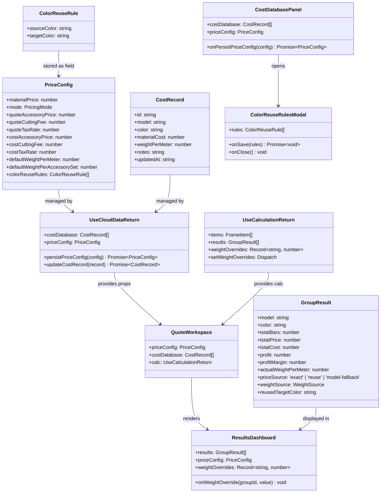
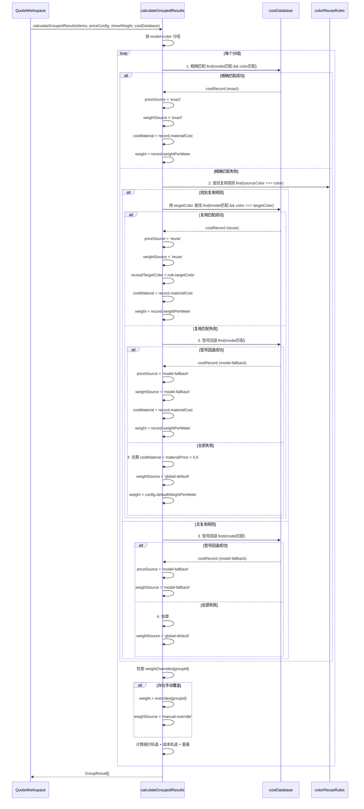
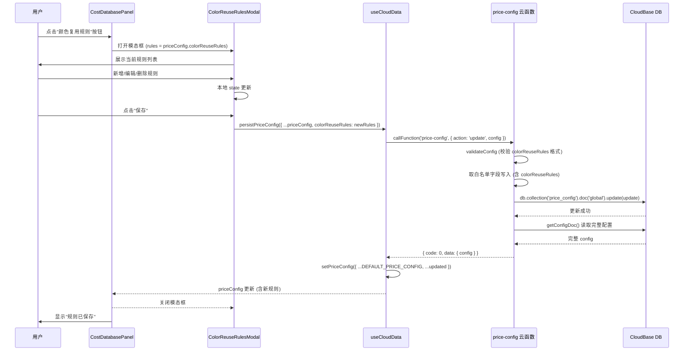
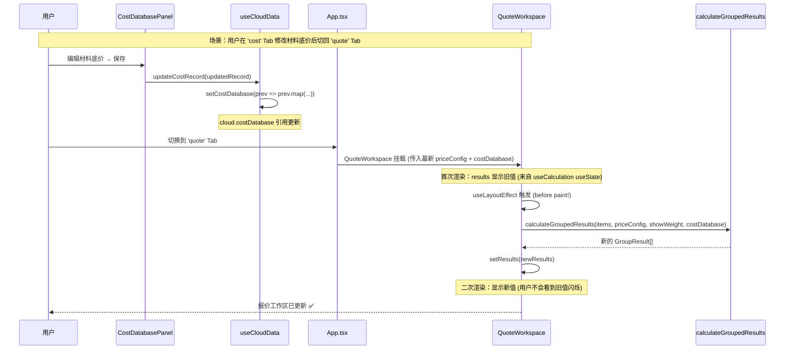
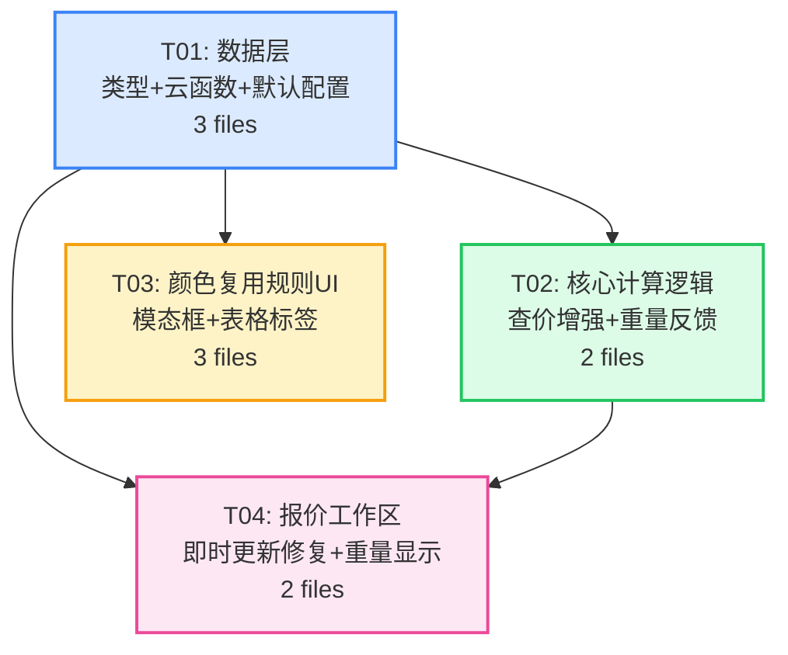

# Nova2 增量需求系统设计 + 任务分解

> **架构师**: 高见远 (Bob)
> **版本**: V5-Incremental (颜色复用规则 + 即时更新修复 + 重量反馈)
> **日期**: 2025-07
> **项目路径**: `C:\codefils\nova2`

---

## Part A: 系统设计

### 1. 实现方案 + 框架选型

#### 1.1 技术栈

本轮增量**不引入新框架**，基于现有技术栈实现：

| 层级 | 技术 | 说明 |
|------|------|------|
| 前端框架 | React 18 + TypeScript | 现有 |
| UI 组件库 | Tailwind CSS (自定义组件) | 现有，模态框用原生实现 |
| 云函数 | CloudBase (Node.js) | 现有 |
| 数据库 | CloudBase DB (文档型) | 现有，price_config 集合 |

#### 1.2 关键设计决策

**决策1：`ColorReuseRule` 数据结构**

```typescript
export interface ColorReuseRule {
  sourceColor: string;   // 源颜色名（如"哑银"）
  targetColor: string;   // 目标颜色名（如"哑黑"）
}
```

- 存储为 `PriceConfig.colorReuseRules: ColorReuseRule[]`
- 作用范围：全局规则（不分型号）
- 预设规则在云函数 `getDefaultConfig()` 中初始化

**决策2：查价优先级链路**

```
精确匹配(型号+颜色) → 复用规则匹配(同型号+目标颜色) → 型号回退 → 估算
```

- `priceSource` 扩展为 `'exact' | 'reuse' | 'model-fallback'`
- 复用时重量也取目标颜色的 `weightPerMeter`

**决策3：重量覆盖方案**

- 临时覆盖，仅存在于 `useCalculation` 的 React state
- 不持久化到云端、不写入 `PriceConfig`
- 覆盖值通过 `ResultsDashboard` 的 inline input 传入

#### 1.3 即时更新 Bug 根因分析

**排查文件与发现：**

| 文件 | 检查内容 | 结论 |
|------|---------|------|
| `QuoteWorkspace.tsx` L93-105 | useEffect 依赖数组 | `[items, priceConfig, showWeight, costDatabase]` — 依赖完整 ✅ |
| `useCloudData.ts` L160-168 | `updateCostRecord` 的 setXxx | `setCostDatabase((prev) => prev.map(...))` — 创建新数组引用 ✅ |
| `useCloudData.ts` L189-196 | `persistPriceConfig` 的 setXxx | `setPriceConfig({ ...DEFAULT_PRICE_CONFIG, ...updated })` — 创建新对象引用 ✅ |
| `App.tsx` L135-150 | QuoteWorkspace 条件渲染 | `{activeTab === 'quote' && <QuoteWorkspace />}` — 条件渲染 |
| `CostDatabasePanel.tsx` L258-279 | `handleSaveCostRates` | 调用 `onPersistPriceConfig` + `onPriceConfigChange` — 双重 setPriceConfig |
| `useCalculation.ts` L99-109 | deps 参数传递 | `deps` 对象每次渲染重建，但仅用于 callback 闭包，不触发 recalc |

**确认根因：QuoteWorkspace 条件渲染导致卸载/重载**

核心链路分析：

```
用户在 'cost' Tab 修改材料底价
  → useCloudData.updateCostRecord() → setCostDatabase(prev => prev.map(...))
  → cloud.costDatabase 引用更新 → App.tsx 重新渲染
  → 但 activeTab === 'cost'，QuoteWorkspace 未挂载
  → QuoteWorkspace 的 useEffect 不会执行
  → results（在 useCalculation 的 useState 中）保持旧值

用户切换到 'quote' Tab
  → QuoteWorkspace 重新挂载
  → 首次渲染：results 显示旧值（来自 useCalculation 的 useState，跨 Tab 保留）
  → useEffect 在首次渲染后触发（after paint）
  → calculateGroupedResults 用最新 priceConfig + costDatabase 重算
  → setResults(newResults) → 二次渲染：显示新值
```

**根因总结：**

1. **主因**：QuoteWorkspace 被 `{activeTab === 'quote' && ...}` 条件渲染，切换 Tab 时组件卸载/重载。虽然重载后 useEffect 会触发重算，但**首帧渲染显示旧 results**（来自 `useCalculation` 的 useState 跨 Tab 保留），造成视觉上"未更新"的感知。

2. **次因**：`useCalculation` 的 `deps` 参数每次渲染创建新对象，导致 `copyQuotation`、`saveCurrentToHistory` 等 `useCallback` 每次渲染重建。虽然不影响计算正确性，但造成不必要的重渲染开销。

3. **`handleSaveCostRates` 双重 setPriceConfig**：`onPersistPriceConfig` 内部已调 `setPriceConfig`，外部又调 `onPriceConfigChange(saved)` 再次 set，虽然 React 18 会 batch 两者，但逻辑冗余。

**修复方案：**

- **方案A（推荐，改动最小）**：将 `QuoteWorkspace` 的 `useEffect` 改为 `useLayoutEffect`，在浏览器绘制前完成重算，消除首帧旧值闪烁。
- **方案B（备选）**：QuoteWorkspace 改为 `display:none` 隐藏而非卸载（`{activeTab !== 'quote' && 'hidden'}`），保持组件挂载状态。改动较大，不推荐。
- **方案C（补充）**：清理 `handleSaveCostRates` 中冗余的 `onPriceConfigChange(saved)` 调用（`persistPriceConfig` 内部已更新 state）。

> **本轮采用方案A + 方案C。**

---

### 2. 文件清单

| # | 文件路径 | 修改类型 | 说明 |
|---|---------|---------|------|
| 1 | `src/types.ts` | [修改] | 新增 `ColorReuseRule` 接口；`PriceConfig` 加 `colorReuseRules` 字段；`GroupResult.priceSource` 类型扩展为 `'exact' \| 'reuse' \| 'model-fallback'`；新增 `WeightSource` 类型 |
| 2 | `src/utils/calculation.ts` | [修改] | 查价逻辑增强（复用规则匹配）；重量取值增强（复用时取目标颜色值）；`priceSource` 扩展 |
| 3 | `src/hooks/useCloudData.ts` | [修改] | `DEFAULT_PRICE_CONFIG` 加预设复用规则 |
| 4 | `src/hooks/useCalculation.ts` | [修改] | 新增 `weightOverrides` 临时 state + setter；传递给 QuoteWorkspace |
| 5 | `src/components/quote/QuoteWorkspace.tsx` | [修改] | `useEffect` → `useLayoutEffect`（Bug 修复）；接收 `weightOverrides` 并传入 ResultsDashboard |
| 6 | `src/components/quote/ResultsDashboard.tsx` | [修改] | 线密度来源标签显示；手动覆盖 input（临时）；priceSource 标签增强 |
| 7 | `src/components/cost/CostDatabasePanel.tsx` | [修改] | 颜色复用规则入口按钮 + 表格标签显示；清理冗余 setPriceConfig |
| 8 | `src/components/cost/ColorReuseRulesModal.tsx` | [新增] | 颜色复用规则编辑模态框（增删改查） |
| 9 | `cloudfunctions/price-config/index.js` | [修改] | `CONFIG_FIELDS` 加 `colorReuseRules`；`getDefaultConfig` 加预设规则；`validateConfig` 加规则校验 |
| 10 | `src/App.tsx` | [修改] | 传递 `colorReuseRules` 相关 props 到 CostDatabasePanel |

**合计：9 个修改 + 1 个新增 = 10 个文件**

---

### 3. 数据结构和接口



**关键类型定义：**

```typescript
// 新增接口
export interface ColorReuseRule {
  sourceColor: string;
  targetColor: string;
}

// WeightSource 类型
export type WeightSource = 'exact' | 'reuse' | 'model-fallback' | 'global-default' | 'manual-override';

// PriceConfig 新增字段
colorReuseRules: ColorReuseRule[];

// GroupResult 字段扩展
priceSource: 'exact' | 'reuse' | 'model-fallback';
weightSource?: WeightSource;           // 新增：线密度来源标记
reusedTargetColor?: string;            // 新增：复用时实际使用的目标颜色

// useCalculation 新增
weightOverrides: Record<string, number>;   // key = groupId (model-color), value = 覆盖的线密度
setWeightOverrides: React.Dispatch<React.SetStateAction<Record<string, number>>>;
```

---

### 4. 程序调用流程

#### 4.1 查价逻辑流程（含复用规则）



#### 4.2 颜色复用规则编辑流程



#### 4.3 即时更新修复流程



---

### 5. 任务列表

| 任务ID | 任务名称 | 涉及文件 | 依赖任务 | 文件数 | 优先级 |
|--------|---------|---------|---------|--------|--------|
| T01 | 数据层：类型定义 + 云函数 + 默认配置 | `src/types.ts`, `cloudfunctions/price-config/index.js`, `src/hooks/useCloudData.ts` | 无 | 3 | P0 |
| T02 | 核心计算逻辑：查价增强 + 重量反馈 | `src/utils/calculation.ts`, `src/hooks/useCalculation.ts` | T01 | 2 | P0 |
| T03 | 颜色复用规则 UI：模态框 + 表格标签 | `src/components/cost/ColorReuseRulesModal.tsx` (新增), `src/components/cost/CostDatabasePanel.tsx`, `src/App.tsx` | T01 | 3 | P1 |
| T04 | 报价工作区：即时更新修复 + 重量显示 | `src/components/quote/QuoteWorkspace.tsx`, `src/components/quote/ResultsDashboard.tsx` | T01, T02 | 2 | P0 |

**合计：4 个任务，10 个文件**

---

### 6. 依赖包列表

**本轮增量无需新增任何 npm 依赖。**

所有功能基于现有技术栈实现：
- 模态框：原生 React state + Tailwind CSS（项目已有模式）
- 表格标签：Tailwind CSS badge
- 颜色选择：原生 `<input type="text">` 或 `<datalist>`（从现有 costDatabase 颜色列表提取）

---

### 7. 共享知识（跨文件约定）

#### 7.1 数据流约定

```
price-config 云函数 (唯一数据源)
  ↓ get/update
useCloudData.priceConfig (React state)
  ↓ props 传递
App.tsx → CostDatabasePanel / QuoteWorkspace
  ↓ 调用
calculateGroupedResults (纯函数，接收 priceConfig + costDatabase)
  ↓ 返回
GroupResult[] (含 priceSource + weightSource)
```

#### 7.2 颜色复用规则约定

- **存储位置**：`price_config` 集合的 `global` 文档，字段 `colorReuseRules`
- **数据格式**：`[{ sourceColor: string, targetColor: string }]`
- **匹配方式**：大小写不敏感（`.toLowerCase()` 比较，与现有查价逻辑一致）
- **优先级**：精确匹配 > 复用规则 > 型号回退 > 估算
- **预设规则**（5 条）：

| 源颜色 | 目标颜色 |
|--------|---------|
| 哑银 | 哑黑 |
| 浅哑金 | 哑黑 |
| 磨砂白 | 哑黑 |
| 亮钛金 | 磨光亮金 |
| 紫金 | 磨光亮金 |

#### 7.3 重量覆盖约定

- **存储位置**：`useCalculation` 的 `weightOverrides` useState（临时，不持久化）
- **Key 格式**：`${model}-${color}`（与分组 key 一致）
- **清除时机**：用户切换算料池（`clearAll`）时清空
- **优先级**：manual-override > exact > reuse > model-fallback > global-default

#### 7.4 priceSource / weightSource 标签显示

| priceSource | 标签文本 | 颜色 |
|-------------|---------|------|
| `exact` | 不显示（精确匹配，无需提示） | — |
| `reuse` | `↻ [目标颜色]` | 蓝色 `bg-blue-50 text-blue-600` |
| `model-fallback` | `← 型号回退` | 琥珀色 `bg-amber-50 text-amber-600` |

| weightSource | 标签文本 | 颜色 |
|-------------|---------|------|
| `exact` | `精确` | 绿色 |
| `reuse` | `复用↻` | 蓝色 |
| `model-fallback` | `型号回退` | 琥珀色 |
| `global-default` | `默认` | 灰色 |
| `manual-override` | `手动✏️` | 紫色 |

#### 7.5 CostDatabasePanel 表格复用标签

在颜色列旁显示复用信息：
- 如果该颜色是某条规则的**源颜色**：显示 `↻ 目标颜色`（如 `↻ 哑黑`）
- 如果该颜色是某条规则的**目标颜色**：显示 `← N个复用`（如 `← 3个复用`，N = 引用此颜色的规则数）

#### 7.6 即时更新修复约定

- `QuoteWorkspace.tsx`：将 `useEffect` 替换为 `useLayoutEffect`（仅修改 import + 调用名，逻辑不变）
- `CostDatabasePanel.tsx`：`handleSaveCostRates` 中移除冗余的 `onPriceConfigChange(saved)` 调用（`persistPriceConfig` 内部已更新 state）

---

### 8. 待明确事项

| # | 问题 | 当前假设 | 风险 |
|---|------|---------|------|
| 1 | 复用规则的源颜色是否需要从现有 costDatabase 的颜色列表中选择？ | 否，用户可自由输入任意颜色名（文本输入 + datalist 建议） | 低 — 若需要限定可选范围可后续加约束 |
| 2 | 同一源颜色是否允许多条规则（指向不同目标）？ | 否，一对一映射。新增时若 sourceColor 已存在则提示覆盖 | 低 |
| 3 | 重量覆盖是否需要"恢复默认"按钮？ | 是，覆盖 input 旁加一个 ↺ 按钮清除该组覆盖 | 低 |
| 4 | 颜色复用规则编辑是否需要角色权限控制？ | 否，所有登录用户均可编辑（与现有成本费率编辑权限一致） | 低 |
| 5 | 复用规则是否影响"保存到历史"的快照？ | 是，`HistoryRecord.priceConfig` 会包含 `colorReuseRules`，历史记录可完整还原 | 低 |
| 6 | `useLayoutEffect` 在 SSR 环境下会报警告，是否需要处理？ | 否，本项目为纯 CSR（Vite SPA），无 SSR | 无 |

---

### 9. 任务依赖图



**执行顺序**：T01 → (T02, T03 并行) → T04

---

### 附录：各任务详细说明

#### T01: 数据层 — 类型定义 + 云函数 + 默认配置

**目标**：建立 `ColorReuseRule` 数据结构全链路打通

**修改内容**：

1. **`src/types.ts`**：
   - 新增 `export interface ColorReuseRule { sourceColor: string; targetColor: string; }`
   - `PriceConfig` 新增 `colorReuseRules: ColorReuseRule[]`
   - `GroupResult.priceSource` 类型从 `'exact' | 'model-fallback'` 扩展为 `'exact' | 'reuse' | 'model-fallback'`
   - 新增 `export type WeightSource = 'exact' | 'reuse' | 'model-fallback' | 'global-default' | 'manual-override'`
   - `GroupResult` 新增 `weightSource?: WeightSource` 和 `reusedTargetColor?: string`

2. **`cloudfunctions/price-config/index.js`**：
   - `CONFIG_FIELDS` 数组新增 `'colorReuseRules'`
   - `getDefaultConfig()` 返回对象新增 `colorReuseRules: [...预设5条规则]`
   - `validateConfig()` 新增 `colorReuseRules` 格式校验（数组、每项含 sourceColor + targetColor 字符串）
   - `handleUpdate` 中 `colorReuseRules` 不走数值强转逻辑（需排除 `'mode'` 和 `'colorReuseRules'`）

3. **`src/hooks/useCloudData.ts`**：
   - `DEFAULT_PRICE_CONFIG` 新增 `colorReuseRules` 预设5条规则

---

#### T02: 核心计算逻辑 — 查价增强 + 重量反馈

**目标**：`calculateGroupedResults` 支持复用规则匹配，重量取值增强

**修改内容**：

1. **`src/utils/calculation.ts`**：
   - `calculateGroupedResults` 函数签名新增第5参数 `colorReuseRules: ColorReuseRule[] = []`
   - 查价逻辑改为四级匹配链路（精确 → 复用 → 型号回退 → 估算）
   - 复用匹配时：查找 `colorReuseRules.find(r => r.sourceColor.toLowerCase() === color.toLowerCase())`，找到后用 `rule.targetColor` 在 costDatabase 中查找同型号记录
   - 重量取值：复用匹配时使用目标颜色记录的 `weightPerMeter`；型号回退时使用回退记录的 `weightPerMeter`
   - `GroupResult` 填充 `priceSource`、`weightSource`、`reusedTargetColor`

2. **`src/hooks/useCalculation.ts`**：
   - 新增 `const [weightOverrides, setWeightOverrides] = useState<Record<string, number>>({})`
   - `clearAll` 中增加 `setWeightOverrides({})`
   - 在返回值中新增 `weightOverrides` 和 `setWeightOverrides`
   - `calculateGroupedResults` 调用处需传入 `priceConfig.colorReuseRules`（需修改 QuoteWorkspace 中的调用）

---

#### T03: 颜色复用规则 UI — 模态框 + 表格标签

**目标**：提供复用规则的增删改查界面 + CostDatabasePanel 表格标签

**修改内容**：

1. **`src/components/cost/ColorReuseRulesModal.tsx`**（新增）：
   - Props: `{ rules: ColorReuseRule[]; onSave: (rules: ColorReuseRule[]) => Promise<void>; onClose: () => void }`
   - 本地 state 管理草稿规则列表
   - 表格展示：源颜色 → 目标颜色，每行可编辑/删除
   - 新增行：两个 text input（带 datalist 从 costDatabase 颜色列表建议）
   - 保存按钮：调用 `onSave`，成功后关闭
   - 预设规则提示文案

2. **`src/components/cost/CostDatabasePanel.tsx`**：
   - Header 区新增"颜色复用规则"按钮
   - 新增 `showReuseModal` state
   - `ColorReuseRulesModal` 渲染 + onSave 回调（调用 `onPersistPriceConfig`）
   - 表格颜色列旁添加复用标签：
     - 源颜色行：`↻ {targetColor}` 蓝色 badge
     - 目标颜色行：`← {N}个复用` 灰色 badge
   - `handleSaveCostRates` 中移除冗余 `onPriceConfigChange(saved)` 调用

3. **`src/App.tsx`**：
   - CostDatabasePanel 已有 `priceConfig` prop（含 colorReuseRules），无需额外传递
   - 确认 props 链路完整（colorReuseRules 随 priceConfig 流转）

---

#### T04: 报价工作区 — 即时更新修复 + 重量显示

**目标**：修复即时更新 Bug + ResultsDashboard 线密度来源显示 + 手动覆盖

**修改内容**：

1. **`src/components/quote/QuoteWorkspace.tsx`**：
   - `import { useEffect } from 'react'` → `import { useLayoutEffect } from 'react'`
   - `useEffect(() => { ... }, [...])` → `useLayoutEffect(() => { ... }, [...])`
   - `calculateGroupedResults` 调用增加第5参数 `priceConfig.colorReuseRules`
   - 从 `calc` 解构 `weightOverrides` 和 `setWeightOverrides`
   - 传递 `weightOverrides` 和 `onWeightOverride` 回调到 `ResultsDashboard`

2. **`src/components/quote/ResultsDashboard.tsx`**：
   - Props 新增 `weightOverrides: Record<string, number>` 和 `onWeightOverride: (groupId: string, value: number) => void`
   - 分组 header 区：
     - 线密度显示改为：`密度: {value} kg/m [{weightSource标签}]`
     - 新增 inline input（可手动覆盖线密度），旁有 ↺ 恢复按钮
   - priceSource 标签增强：
     - `reuse`：显示 `↻ {reusedTargetColor}` 蓝色 badge
     - `model-fallback`：显示 `← 型号回退` 琥珀色 badge
   - 底部重量区同步显示 weightSource 标签
