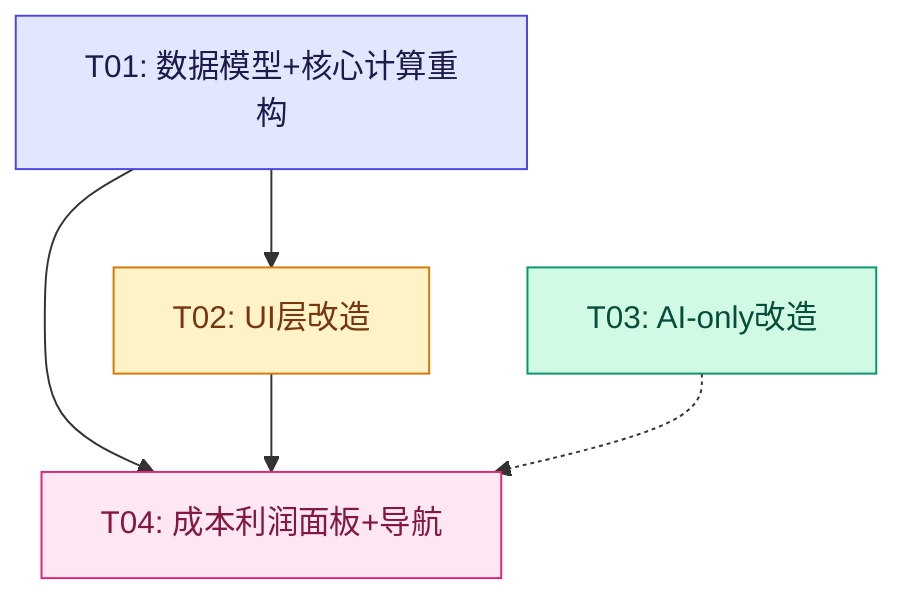

# Nova2 第二轮增量重构方案

> **版本**: v2.0-incremental  
> **日期**: 2026-02-09  
> **架构师**: Bob (software-architect)  
> **状态**: 待评审

---

## 一、需求确认与优先级排序

### 1.1 需求依赖关系分析

```
需求4(重量字段) ──┐
                  ├──→ 需求5(全局费率) ──→ 需求3(成本利润面板)
需求5(全局费率) ──┘                    ↑
                                      │
需求1(AI识别)  ────────────────────────┘ (面板内可能展示AI解析状态)
                                      │
需求2(报价参数UI) ─────────────────────┘ (面板内包含费率配置入口)
                                      │
需求6(同型号共享单价) ─────────────────┘ (影响成本查价逻辑，面板需展示)
```

### 1.2 推荐实施顺序（按依赖 + 风险排序）

| 优先级 | 需求 | 理由 |
|--------|------|------|
| **P0** | 需求4: 材料重量字段 | 数据模型基础变更，其他需求依赖它 |
| **P0** | 需求5: 全局统一费率 | 核心计算逻辑变更，影响最广 |
| **P1** | 需求1: AI智能识别替代本地识别 | 行为变更较大，但与其他改动独立 |
| **P1** | 需求2: 报价参数UI改造+记忆 | UI优化，独立性强 |
| **P2** | 需求3: 成本利润面板 | 新功能页，依赖4+5的计算结果 |
| **P2** | 需求6: 同型号共享单价 | 查价逻辑优化，可在T01一并处理 |

---

## 二、数据模型变更 (`types.ts`)

### 2.1 `CostRecord` 增加重量字段

```typescript
// ▼ 变更前
export interface CostRecord {
  id: string;
  model: string;
  color: string;
  materialCost: number;    // 元/米
  accessoryCost: number;   // 元/套
  cuttingCost: number;     // 元/个
  notes?: string;
  updatedAt: string;
}

// ▼ 变更后
export interface CostRecord {
  id: string;
  model: string;
  color: string;
  materialCost: number;    // 元/米 (材料底价)
  weightPerMeter: number;  // 🆕 kg/m (型材线密度)
  notes?: string;
  updatedAt: string;
  // ⚠️ 以下字段已移至 PriceConfig 全局管理:
  // - accessoryCost → 由 PriceConfig.globalAccessoryPrice 统一
  // - cuttingCost   → 由 PriceConfig.globalCuttingFee 统一
}
```

### 2.2 `PriceConfig` 结构调整

```typescript
// ▼ 变更前
export interface PriceConfig {
  materialPrice: number;      // 元/米 (报价用)
  accessoryPrice: number;     // 元/个 (报价用)
  cuttingFee: number;         // 元/个 (报价用)
  taxRate: number;            // 如 1.13 表示 13%税
  mode: PricingMode;
  weightPerMeter: number;     // kg/m (全局默认重量)
  weightPerAccessorySet: number; // kg/套
}

// ▼ 变更后
export interface PriceConfig {
  // ---- 报价参数 ----
  materialPrice: number;      // 元/米 (材料报价单价)
  mode: PricingMode;          // 批量单 / 零散单
  
  // ---- 全局统一费率 (🆕 重构) ----
  globalAccessoryPrice: number;  // 🆕 元/套 (全局配件单价)
  globalCuttingFee: number;      // 🆕 元/米 (全局切割单价，按总切割长度计费)
  globalTaxRate: number;         // 🆕 如 0.13 表示 13%税率 (或 0 表示无税)
  
  // ---- 重量参数 ----
  defaultWeightPerMeter: number;  // 🆕 重命名: kg/m 默认线密度
  defaultWeightPerAccessorySet: number; // 🆕 重命名: kg/套 配件重量
}
```

### 2.3 `GroupResult` 新增字段

```typescript
// 在现有 GroupResult 中新增:
export interface GroupResult {
  // ... 现有字段保持不变 ...
  
  // 🆕 成本明细 (更细粒度)
  totalCuttingLength?: number;  // 总切割长度 (米)
  taxCost?: number;             // 税金成本 (单独列示)
  
  // 🆕 重量明细 (从 costDatabase 取实际值)
  actualWeightPerMeter?: number; // 实际使用的线密度
}
```

---

## 三、每个需求的详细实现方案

### 需求1: AI智能识别替代本地识别

**核心思路**: 移除 `parseTextToItems` 的正则降级路径，所有文本输入强制走 `parseOrderWithAi`。

#### 涉及文件与具体操作

| 文件 | 操作 | 详细描述 |
|------|------|----------|
| `hooks/useCalculation.ts` | **修改** | `addItemByText()` 函数：移除 `else` 分支的 `parseTextToItems()` 调用；当 `!aiSettings.apiKey` 时弹出明确引导提示而非静默降级 |
| `hooks/useCalculation.ts` | **修改** | `processSingleUploadedFile()` 函数：同上，无 API key 时给出引导提示；AI 返回空结果时不再 fallback 到 `processLocalFile()` |
| `components/quote/InputPanel.tsx` | **修改** | 移除「传统/AI」切换按钮 (整个 toggle 区域)；textarea placeholder 统一改为 AI 模式文案；检测到无 apiKey 时显示警告横幅 |
| `services/parsingService.ts` | **保留不删除** | `parseTextToItems` 和 `processLocalFile` 函数体保留（AI 服务不可用时仍可用于文件内容提取为文本），但不再直接产出 FrameItem |

#### 关键函数变更伪代码

```typescript
// useCalculation.ts → addItemByText()
const addItemByText = useCallback(async (text, overrideAiSettings) => {
  const effectiveAiSettings = overrideAiSettings || deps?.aiSettings;
  if (!text.trim()) return;

  // 🆕 强制检查 AI 配置
  if (!effectiveAiSettings?.apiKey) {
    alert('⚠️ 尚未配置 AI API Key，无法使用智能识别。\n\n请前往「系统设置」→「AI服务配置」填写 API Key 后再使用。\n\n支持 DeepSeek / Gemini / OpenAI。');
    return;
  }

  setIsLoading(true);
  setStatusMsg('正在通过 AI 模型识别订单...');
  try {
    const parsed = await parseOrderWithAi(text, effectiveAiSettings);
    if (parsed.length === 0) {
      alert('AI 未能提取到有效项目，请检查输入格式或换个说法重试。');
    } else {
      const validItems = parsed.filter((item) => !validateFrameItem(item));
      setItems((prev) => [...prev, ...validItems]);
      setInputText('');
    }
  } catch (err: any) {
    alert(`AI 识别出错: ${err.message || err}`);
  } finally {
    setIsLoading(false);
    setStatusMsg('');
  }
}, []);
```

#### 向后兼容
- 已有的 localStorage 中缓存的 items 不受影响
- `parsingService.ts` 的函数保留不被删，避免破坏文件上传的文本提取能力（图片OCR等仍需要先提取文本再交给AI）

---

### 需求2: 报价参数UI — 数字输入 + 记忆上次值

**现状分析**: 当前 `PriceConfigCard.tsx` 已经使用 `<input type="number">`（非 stepper），所以主要工作是增加 localStorage 记忆。

#### 涉及文件与具体操作

| 文件 | 操作 | 详细描述 |
|------|------|----------|
| `hooks/useLocalStorage.ts` | **修改** | 新增 `priceConfigMemory` state + localStorage key `aluminum_price_config_memory`；在字段 onBlur 时持久化各字段值 |
| `components/quote/PriceConfigCard.tsx` | **修改** | 接收 `priceConfigMemory` prop；每个 input 增加 `defaultValue` 回填逻辑；增加 min/max/step 约束 |

#### 具体实现方案

```typescript
// useLocalStorage.ts 中新增
interface PriceConfigMemory {
  materialPrice: number;
  globalAccessoryPrice: number;
  globalCuttingFee: number;
  globalTaxRate: number;
  defaultWeightPerMeter: number;
  defaultWeightPerAccessorySet: number;
}

const DEFAULT_PRICE_MEMORY: PriceConfigMemory = {
  materialPrice: 45,
  globalAccessoryPrice: 15,
  globalCuttingFee: 3,
  globalTaxRate: 0.13,
  defaultWeightPerMeter: 0.85,
  defaultWeightPerAccessorySet: 0.12,
};
```

#### 输入框约束表

| 字段 | label | min | max | step | 默认值 |
|------|-------|-----|-----|------|--------|
| materialPrice | 材料报价(元/米) | 0 | 9999 | 0.01 | 45 |
| globalAccessoryPrice | 配件单价(元/套) | 0 | 999 | 0.01 | 15 |
| globalCuttingFee | 切割单价(元/米) | 0 | 99 | 0.01 | 3 |
| globalTaxRate | 税率(0=无税) | 0 | 0.30 | 0.01 | 0.13 |
| defaultWeightPerMeter | 默认重量(kg/m) | 0 | 10 | 0.001 | 0.85 |
| defaultWeightPerAccessorySet | 配件重量(kg/套) | 0 | 5 | 0.001 | 0.12 |

---

### 需求3: 左侧导航新增「💰 成本利润」Tab

#### 涉及文件与具体操作

| 文件 | 操作 | 详细描述 |
|------|------|----------|
| `types.ts` | **修改** | `ActiveTab` 类型加入 `'profit'` |
| `components/layout/Sidebar.tsx` | **修改** | navItems 数组增加 `{ key: 'profit', label: '💰 成本利润', iconPath: '...' }`；props 类型中 ActiveTab 联合类型扩展 |
| `App.tsx` | **修改** | ActiveTab 类型扩展；增加 `{activeTab === 'profit' && (<CostProfitPanel .../>)}` 渲染分支 |
| `components/profit/CostProfitPanel.tsx` | **新建** | 独立的成本利润分析页面组件 |

#### CostProfitPanel 设计规格

```
props:
  - results: GroupResult[]        (当前计算结果)
  - priceConfig: PriceConfig     (费率配置)
  - costDatabase: CostRecord[]   (材料成本库)
  - showCosts: boolean           (权限控制)
  - clientName: string

展示内容 (自上而下):
┌─────────────────────────────────────────────┐
│ 📊 成本利润深度分析                          │
├─────────────────────────────────────────────┤
│                                             │
│  ┌──────────┬──────────┬──────────┐        │
│  │ 材料成本  │ 配件成本  │ 切工成本  │        │
│  │ ¥XXXX   │ ¥XXX    │ ¥XXX    │        │
│  ├──────────┼──────────┼──────────┤        │
│  │ 税金成本  │          │ 总成本   │        │
│  │ ¥XXX    │          │ ¥XXXX   │        │
│  └──────────┴──────────┴──────────┘        │
│                                             │
│  ┌─────────────────────────────────────┐   │
│  │ 合计报价: ¥XXXX  │ 毛利: ¥XXX       │   │
│  │ 利润率: XX.X%    │                  │   │
│  └─────────────────────────────────────┘   │
│                                             │
│  📋 按型号分组的材料成本明细表格              │
│  ┌──────┬──────┬───────┬──────┬──────┐     │
│  │ 型号  │ 颜色 │ 长度m  │ 单价  │ 小计  │     │
│  │ D1822│ 黑色 │ 12.60 │ 22.50│ 283.5│     │
│  │ Y3011│ 灰色 │ 9.45  │ 28.50│ 269.3│     │
│  └──────┴──────┴───────┴──────┴──────┘     │
│                                             │
│  📦 重量汇总                                │
│  材料总重: XX.XXkg  配件总重: X.XXkg       │
│                                             │
└─────────────────────────────────────────────┘
```

---

### 需求4: 材料成本资料库增加重量字段

#### 涉及文件与具体操作

| 文件 | 操作 | 详细描述 |
|------|------|----------|
| `types.ts` | **修改** | `CostRecord` 增加 `weightPerMeter: number` 字段；移除 `accessoryCost` 和 `cuttingCost` 字段 |
| `components/cost/CostDatabasePanel.tsx` | **修改** | 表单增加「重量(kg/m)」输入框；表格增加重量列；移除配件/切工列；DEFAULT_COST_FORM 调整 |
| `utils/calculation.ts` | **修改** | 成本查找逻辑使用 `costRecord.weightPerMeter` 替代 `config.weightPerMeter`(如果有)；成本计算公式调整（见需求5） |
| `hooks/useLocalStorage.ts` | **修改** | `seedCostRecords()` 种子数据增加 `weightPerMeter` 字段 |
| `hooks/useCalculation.ts` | **修改** | `handleCostFileUpload()` 中规则导入解析增加重量字段 |
| `services/aiService.ts` | **修改** | `COST_SYSTEM_PROMPT` 增加 `weightPerMeter` 提取指示 |

#### DEFAULT_COST_FORM 变更

```typescript
// 变更前
const DEFAULT_COST_FORM = { model:'', color:'', materialCost:25, accessoryCost:8, cuttingCost:5, notes:'' };

// 变更后
const DEFAULT_COST_FORM = { 
  model:'', 
  color:'', 
  materialCost:25, 
  weightPerMeter:0.85,  // 🆕 
  notes:'' 
};
```

---

### 需求5: 配件/切工/税金改为全局统一费率

**这是本轮最大的逻辑重构点。**

#### 当前逻辑 (变更前)

```
成本计算 (按组):
  materialCost = totalBars * 3.05 * costRecord.materialCost
  accessoryCost = totalQuantity * (costRecord.accessoryPrice || config.accessoryPrice * 0.6)
  cuttingCost   = totalQuantity * (costRecord.cuttingCost || config.cuttingFee * 0.6)
  totalCost     = materialCost + accessoryCost + cuttingCost  ← 无税金
```

#### 目标逻辑 (变更后)

```
成本计算 (按组):
  materialCost = totalBars * BAR_FULL_LENGTH * costRecord.materialCost
  accessoryCost = totalQuantity * config.globalAccessoryPrice        ← 全局统一
  cuttingCost   = totalCuttingLength * config.globalCuttingFee       ← 🆕 按米算
  subTotal      = materialCost + accessoryCost + cuttingCost
  taxCost       = subTotal * config.globalTaxRate                    ← 🆕 单独列示
  totalCost     = subTotal + taxCost
  profit        = totalPrice - totalCost
  profitMargin  = (profit / totalPrice) * 100
```

#### 报价计算同步调整

```
报价 (批量模式):
  uPrice = ((avgMeters * config.materialPrice) + config.globalAccessoryPrice + perFrameCuttingCost) * (1 + config.globalTaxRate)
  其中 perFrameCuttingCost = (frameCuttingLength * config.globalCuttingFee) / quantity

报价 (零散模式):
  uPrice = ((perimeterM * 1.2 * config.materialPrice) + config.globalAccessoryPrice + perFrameCuttingCost) * (1 + config.globalTaxRate)
```

#### 涉及文件与具体操作

| 文件 | 操作 | 详细描述 |
|------|------|----------|
| `types.ts` | **修改** | `PriceConfig` 字段重命名/新增（见第二节） |
| `utils/calculation.ts` | **重大修改** | `calculateGroupedResults()` 整体重写成本和报价计算分支 |
| `components/quote/PriceConfigCard.tsx` | **修改** | fields 数组和标签更新为新字段名 |
| `components/quote/ResultsDashboard.tsx` | **修改** | 成本展示增加「切工(按长度)」和「税金」行 |
| `hooks/useCalculation.ts` | **修改** | copyQuotation、saveCurrentToHistory 中默认值适配新结构 |
| `hooks/useLocalStorage.ts` | **修改** | priceConfig 初始值/默认值适配新字段名；**数据迁移**：读取旧格式自动转换 |

#### 数据迁移策略 (localStorage 向后兼容)

```typescript
// useLocalStorage.ts → priceConfig 初始化时
function migratePriceConfig(saved: any): PriceConfig {
  if (!saved) return DEFAULT_PRICE_CONFIG;
  
  // 检测旧版字段名 → 自动迁移
  return {
    materialPrice: saved.materialPrice ?? 45,
    mode: saved.mode || PricingMode.BATCH,
    // 新字段: 优先取新名，否则从旧名迁移
    globalAccessoryPrice: saved.globalAccessoryPrice ?? saved.accessoryPrice ?? 15,
    globalCuttingFee: saved.globalCuttingFee ?? (saved.cuttingFee ? saved.cuttingFee : 3),
    globalTaxRate: saved.globalTaxRate ?? (saved.taxRate && saved.taxRate > 1 ? saved.taxRate - 1 : 0.13),
    defaultWeightPerMeter: saved.defaultWeightPerMeter ?? saved.weightPerMeter ?? 0.85,
    defaultWeightPerAccessorySet: saved.defaultWeightPerAccessorySet ?? saved.weightPerAccessorySet ?? 0.12,
  };
}
```

---

### 需求6: 同型号不同颜色共享单价的识别优化

#### 核心问题
当前查价逻辑 (calculation.ts L89-94):
```typescript
const costRecord = costDatabase.find(r => 
  r.model === model && r.color === color
) || costDatabase.find(r => 
  r.model === model  // ✅ 已有型号回退！
);
```
**发现**: 当前代码已经有按型号回退的逻辑！但只回退了 `costRecord` 选择，没有在 UI 上告知用户。

#### 需要增强的部分

| 文件 | 操作 | 详细描述 |
|------|------|----------|
| `services/aiService.ts` | **修改** | ORDER_SYSTEM_PROMPT 增加指令：「同一型号的不同颜色应视为相同材料单价，只需正确区分颜色名称」；返回结果中确保 model 字段准确 |
| `utils/calculation.ts` | **修改** | 查价命中型号回退时，在 `GroupResult` 中标记 `priceSource: 'model-fallback'` 及匹配到的颜色；计算 weightPerMeter 时也做相同回退 |
| `components/profit/CostProfitPanel.tsx` | **修改** | 展示时对 `priceSource === 'model-fallback'` 的行显示提示「⚠️ 复用 [颜色] 的单价」|

---

## 四、任务分解 (4个任务)

### T01: 数据模型 + 核心计算引擎重构

**目标**: 完成需求4(重量字段)+需求5(全局费率)的数据层和计算层改造

**涉及文件**:
| # | 文件 | 操作 |
|---|------|------|
| 1 | `src/types.ts` | 修改 — CostRecord/PriceConfig/GroupResult 结构变更 |
| 2 | `src/utils/calculation.ts` | 修改 — 成本&报价公式重写 |
| 3 | `src/hooks/useLocalStorage.ts` | 修改 — 默认值适配 + 数据迁移逻辑 |
| 4 | `src/hooks/useCalculation.ts` | 修改 — 默认值/copyQuotation/saveCurrentToHistory 适配 |
| 5 | `src/constants.ts` | 可能微调 — 确认常量不受影响 |

**具体步骤**:
1. 修改 `types.ts`: CostRecord 加 `weightPerMeter`，去掉 `accessoryCost`/`cuttingCost`；PriceConfig 字段重构；GroupResult 加 `totalCuttingLength`/`taxCost`/`actualWeightPerMeter`
2. 修改 `calculation.ts`: 重写 `calculateGroupedGroups()` 中的成本计算和报价计算；增加总切割长度统计；增加型号回退查价标记
3. 修改 `useLocalStorage.ts`: 更新所有 `PriceConfig` 默认值常量；编写 `migratePriceConfig()` 迁移函数；更新 seed data 加 weightPerMeter
4. 修改 `useCalculation.ts`: 更新硬编码的 PriceConfig 默认值（至少3处）；更新 `handleCostFileUpload` 规则导入的字段映射
5. 验证: 启动应用，添加一个 item，确认 ResultsDashboard 正确显示新的成本分解（材料/配件/切工/税金）

**依赖**: 无  
**验证标准**: 
- 旧版 localStorage 数据加载后能自动迁移为新格式
- 成本计算结果 = 材料 + 配件 + 切工 + 税金，四项清晰分列
- 重量计算使用 costDatabase 中的实际 weightPerMeter（如有）

---

### T02: UI层改造 — 价格配置 + 成本库 + 结果展示

**目标**: 完成需求2(价格记忆)+需求4(成本库重量列)+需求5(PriceConfigCard UI调整)+需求5(ResultsDashboard调整)

**涉及文件**:
| # | 文件 | 操作 |
|---|------|------|
| 1 | `src/components/quote/PriceConfigCard.tsx` | 修改 — 字段/标签/约束全面更新 |
| 2 | `src/components/cost/CostDatabasePanel.tsx` | 修改 — 表单加重量、表格加重量列、去配件切工列 |
| 3 | `src/components/quote/ResultsDashboard.tsx` | 修改 — 成本卡增加税金行、切工按长度展示 |
| 4 | `src/components/quote/FinalSummary.tsx` | 微调 — 适配新字段（如有引用 priceConfig 子字段） |
| 5 | `src/hooks/useLocalStorage.ts` | 修改 — 新增 priceConfigMemory 持久化 |

**具体步骤**:
1. 修改 `PriceConfigCard.tsx`: 更新 fields 数组对应新 PriceConfig 结构；每个 input 加 min/max/step 约束（见上文约束表）；接收并使用 `priceConfigMemory` 做 defaultValue 回填
2. 修改 `CostDatabasePanel.tsx`: DEFAULT_COST_FORM 加 `weightPerMaterial`; 表单加重量输入框; 表格 thead 加「重量(kg/m)」列, 去掉「配件」「切工」列; handleSaveCost/editCostRecord 适配新字段
3. 修改 `ResultsDashboard.tsx`: 成本摘要区域将切工显示改为按长度计量；如 showCosts 则额外显示税金一行
4. 在 `useLocalStorage.ts` 中新增 `priceConfigMemory` state 和对应的 localStorage 读写 effect
5. 验证: 打开报价工作区，修改任意价格参数，刷新页面后确认值被记忆回填

**依赖**: T01 (数据模型必须先就绪)  
**验证标准**:
- PriceConfigCard 所有字段均为 number input 且有合理约束
- 修改参数后刷新页面，值保持不变
- CostDatabasePanel 可正常录入/编辑/删除带重量的成本记录
- ResultsDashboard 正确展示四项成本明细

---

### T03: AI-only 解析改造 + InputPanel 简化

**目标**: 完成需求1(AI替代本地识别)+需求6(AI prompt 优化)

**涉及文件**:
| # | 文件 | 操作 |
|---|------|------|
| 1 | `src/hooks/useCalculation.ts` | 修改 — addItemByText/processSingleUploadedFile 去除本地降级 |
| 2 | `src/components/quote/InputPanel.tsx` | 修改 — 去掉传统/AI toggle；加无apiKey警告 |
| 3 | `src/services/aiService.ts` | 修改 — ORDER_SYSTEM_PROMPT + COST_SYSTEM_PROMPT 优化 |
| 4 | `src/services/parsingService.ts` | 不删但标注 deprecated — 保留文本提取能力 |

**具体步骤**:
1. 修改 `useCalculation.ts`:
   - `addItemByText()`: 删除 else 分支；API key 缺失时 alert 引导用户去设置页
   - `processSingleUploadedFile()`: 删除 else 分支和 AI 失败后的 fallback；无 key 时引导设置
   - 可选: 移除 `useAiParser` state (不再需要)，或保留但不在 UI 中暴露
2. 修改 `InputPanel.tsx`:
   - 删除整个 `useAiParser` toggle 区域 (L97-L120)
   - textarea placeholder 改为纯 AI 模式文案
   - 当 `!aiSettings.apiKey` 时在 header 区域渲染橙色警告横幅:「⚠️ 未配置 AI Key，请前往系统设置配置后使用智能识别」
   - 保留 `useAiParser` prop 接口以减少连锁改动（内部忽略即可）
3. 修改 `aiService.ts`:
   - ORDER_SYSTEM_PROMPT 末尾追加: 「注意：同一型号的不同颜色（如银色/金色）是相同的材料，单价一致，请务必正确填写 model 字段。」
   - COST_SYSTEM_PROMPT 追加 `weightPerMeter` 字段提取说明
4. 验证: 无 API Key 时输入文字点击按钮 → 弹出引导提示；有 Key 时正常走 AI 解析

**依赖**: 无 (与 T01/T02 并行可行，但建议 T01 先完成以免上下文冲突)  
**验证标准**:
- 未配置 API Key 时，任何解析操作都弹出明确的引导提示
- 配置 API Key 后，文本输入和文件上传都走 AI 并正常返回结果
- 不再有「传统模式」选项出现在界面上

---

### T04: 成本利润面板 + 导航集成

**目标**: 完成需求3(新Tab页+独立成本利润面板)

**涉及文件**:
| # | 文件 | 操作 |
|---|------|------|
| 1 | `src/App.tsx` | 修改 — ActiveTab 加 `'profit'`；加 import 和渲染分支 |
| 2 | `src/components/layout/Sidebar.tsx` | 修改 — navItems 加 profit 条目；props 类型扩展 |
| 3 | `src/components/profit/CostProfitPanel.tsx` | **新建** — 独立成本利润分析组件 (~250行) |

**具体步骤**:
1. 修改 `Sidebar.tsx`:
   - ActiveTab 类型联合中加入 `'profit'`
   - navItems 数组在 history 之前插入 profit 条目:
     ```typescript
     { key: 'profit', label: '💰 成本利润', iconPath: 'M12 8c-1.657 0-3 .895-3 2s1.343 2 3 2 3 .895 3 2-1.343 2-3 2m0-8c1.11 0 2.08.402 2.599 1M12 8V7m0 1v8m0 0v1m0-1c-1.11 0-2.08-.402-2.599-1M21 12a9 9 0 11-18 0 9 9 0 0118 0z' }
     ```
2. 修改 `App.tsx`:
   - ActiveTab 类型定义为 `'quote' | 'cost' | 'history' | 'settings' | 'profit'`
   - Sidebar 的 setActiveTab/setActiveTab 类型同步
   - 在 settings 分支之后增加 profit 分支:
     ```tsx
     {activeTab === 'profit' && (
       <CostProfitPanel results={...} priceConfig={...} costDatabase={...} showCosts={...} clientName={...} />
     )}
     ```
3. **新建** `src/components/profit/CostProfitPanel.tsx`:
   - 接收 props: results, priceConfig, costDatabase, showCosts, clientName
   - 内部聚合所有 GroupResult 的成本数据
   - 渲染: ①顶部四格成本卡片 ②中间利润大数字 ③按型号材料明细表格 ④底部重量汇总
   - 当 `results.length === 0` 时显示空态引导:「请在"报价算料工作区"添加算料数据后查看成本分析」
   - 当 `!showCosts` 时遮罩敏感数据
4. 验证: 点击侧边栏「💰 成本利润」→ 显示面板；在有数据时正确展示成本分解

**依赖**: T01 + T02 (需要正确的计算结果和 PriceConfig 新结构)  
**验证标准**:
- 侧边栏正确显示第5个 Tab
- 点击跳转到成本利润面板
- 有算料数据时，面板展示完整的材料/配件/切工/税金/毛利信息
- 无数据时显示友好的空状态引导

---

## 五、任务依赖图



> **并行策略**: T03 与 T01/T02 无文件冲突，可完全并行开发。  
> **推荐顺序**: T01 → T02 → T04（主路径），T03 同步进行。

---

## 六、风险评估

### 高风险项

| 风险 | 影响 | 缓解措施 |
|------|------|----------|
| **PriceConfig 字段重命名导致旧数据丢失** | 用户刷新页面后所有价格配置归零 | 实现 `migratePriceConfig()` 双向兼容迁移函数；首次加载时检测旧字段名并自动转换 |
| **成本计算公式变更导致历史记录不一致** | 已保存的历史记录中的 profit/totalCost 数字与新公式不同 | HistoryRecord 是快照不做重新计算；只在当前工作区使用新公式；可考虑在历史详情中标注「基于旧版公式」 |
| **移除本地解析后无法离线使用** | 无网络或 API 额度耗尽时完全不可用 | 保留 parsingService.ts 中的文本提取能力（用于文件转文本），仅移除其直接生成 FrameItem 的调用链；未来可考虑加回"紧急离线模式"开关 |

### 中风险项

| 风险 | 影响 | 缓解措施 |
|------|------|----------|
| **全局费率的 cuttingFee 从"按个"改"按米"** | 用户心智模型变化，可能造成报价偏差 | UI label 明确写「切割单价(元/米)」并在下方加帮助文案；初始值设合理(3元/m) |
| **CostRecord 删减 accessoryCost/cuttingCost** | 成本库导入的旧 CSV 格式含这两列 | handleCostFileUpload 规则导入时兼容读取（忽略多余列）；AI 导入由新 prompt 控制 |
| **新增 Tab 导致 Sidebar 拥挤** | 5个Tab在小屏下可能溢出 | Sidebar 已有 overflow-y:auto；图标+文字保持紧凑 |

### 低风险项

| 风险 | 影响 | 缓解措施 |
|------|------|----------|
| InputPanel 去掉 toggle 后 useAiParser state 残留 | 代码冗余 | 保留 state 不暴露到 UI 即可，后续清理 |
| weightPerMeter 在 costDatabase 和 PriceConfig 都有 | 使用者优先级不清 | 文档化优先级: costDatabase.weightPerMeter > PriceConfig.defaultWeightPerMeter |

---

## 七、Shared Knowledge (工程师注意事项)

```
1. PriceConfig 字段迁移 (重要!)
   - 旧: { materialPrice, accessoryPrice, cuttingFee, taxRate, weightPerMeter, weightPerAccessorySet }
   - 新: { materialPrice, mode, globalAccessoryPrice, globalCuttingFee, globalTaxRate, defaultWeightPerMeter, defaultWeightPerAccessorySet }
   - 必须在 useLocalStorage 的初始化和 username-change effect 中做双向迁移
   
2. taxRate 语义变更
   - 旧: 1.13 表示含13%税 (乘数)
   - 新: 0.13 表示13%税率 (百分数)
   - 迁移时: newValue = oldValue > 1 ? oldValue - 1 : oldValue

3. cuttingFee 计量单位变更
   - 旧: 元/个 (每框)
   - 新: 元/米 (每米切割长度)
   - 零散单模式的 perFrameCuttingCost = (周长 * 1.2) * globalCuttingFee
   - 批量单模式的 totalCuttingLength 从 edges 累加求得

4. CostRecord 精简
   - 保留: id, model, color, materialCost, weightPerMeter, notes, updatedAt
   - 移除: accessoryCost, cuttingCost (已升至 PriceConfig 全局管理)

5. parsingService.ts 不要删除
   - processLocalFile() 的文本提取能力仍被 processSingleUploadedFile 需要
   - 仅 parseTextToItems() 不再被直接调用产生 FrameItem

6. AI 必配策略
   - 所有用户交互式解析(addItemByText, fileUpload, drop, paste)均要求 aiSettings.apiKey 存在
   - 缺失时弹窗引导至设置页，不做任何降级
```

---

## 八、 unclear / 需确认事项

1. **taxRate 语义最终确认**: 需求中说「税率（如13%）× 材料成本」或「× 报价」，当前方案设计为 × (材料+配件+切工) 小计。请产品确认税基。
2. **是否保留"紧急离线模式"**: 如果彻底移除本地解析，断网时产品完全不可用。是否需要一个隐藏的手动录入表单作为 fallback？
3. **CostDatabasePanel 的历史数据迁移**: 旧的 CostRecord 含 accessoryCost/cuttingCost 但不含 weightPerMeter。导入备份数据时是否需要自动补 weightPerMeter 默认值？
4. **globalCuttingFee 的业务含义确认**: 「每米切割单价」— 这里的"米"是指型材切割长度（即所有边的总长之和）吗？还是指原材料整料的长度？当前方案按前者（切割边长总和）设计。
